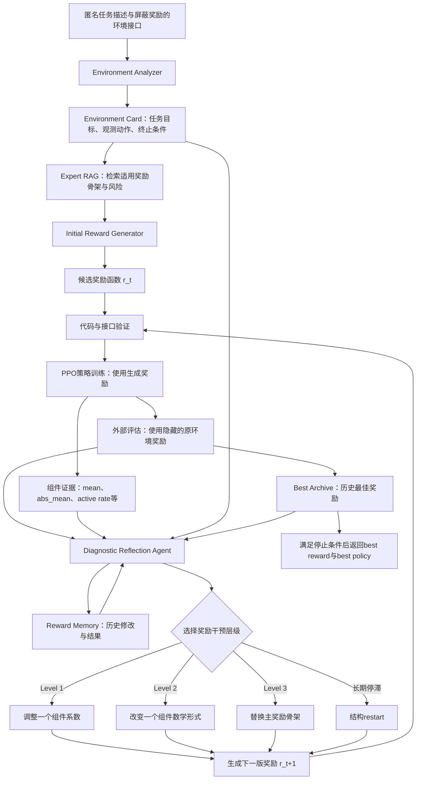
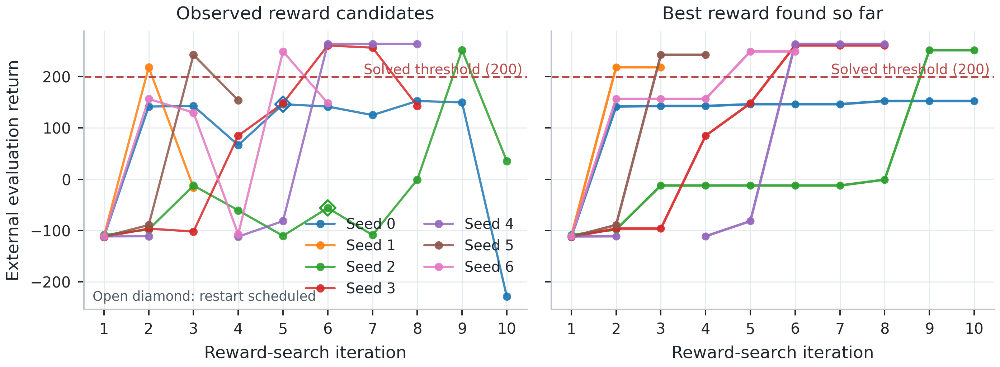
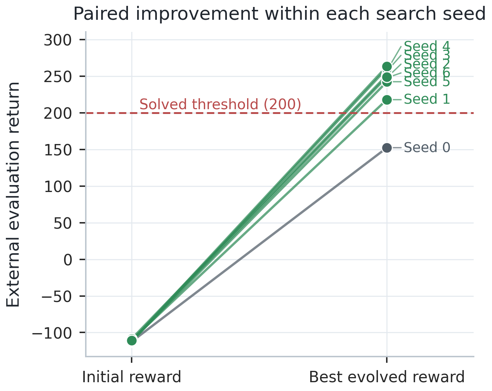
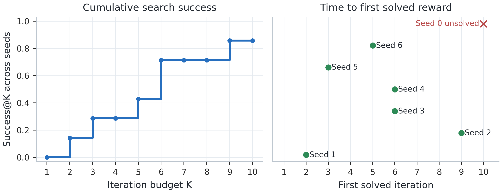
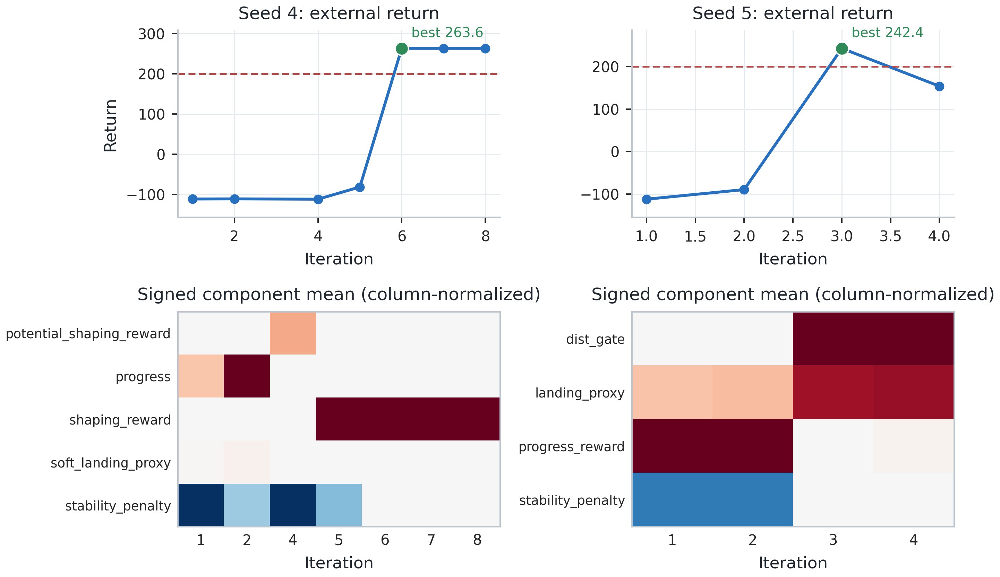

# DERES-Agent：奖励函数自进化研究方案与实验设计

## 0. 方法概述

### 0.1 研究问题

强化学习通过奖励函数判断行为好坏。奖励函数设计不合理时，即使强化学习算法和训练预算充足，策略也可能学会停滞、投机或快速失败。人工奖励设计通常依赖专家反复观察训练结果、分析失败原因并修改公式，成本较高。

大语言模型可以生成奖励代码，但一次生成高度依赖首次采样；独立生成大量候选虽然扩大了搜索范围，却需要为每个候选重新训练策略，并且没有充分利用失败候选产生的训练证据。

DERES-Agent将奖励设计建模为一个连续的Agent决策过程：Agent生成奖励、调用强化学习训练、读取外部评估与奖励组件证据、诊断失败原因，再选择下一次局部修改。失败奖励不会立即被丢弃，而是作为后续修复的起点。

### 0.2 输入、输出与目标

**输入：**

- 匿名化任务描述；
- observation与action的接口语义；
- 屏蔽官方奖励计算后的环境step摘要；
- 奖励设计专家知识库；
- 每轮策略训练和评估结果。

**输出：**

- 一个可执行的奖励函数；
- 使用该奖励训练得到的策略；
- 完整的奖励修改、评估和选择轨迹；
- 搜索过程中观察到的历史最佳奖励。

**优化目标：**

> 在有限的LLM调用次数和PPO训练预算内，尽可能提高找到达到任务解决阈值奖励函数的概率，并降低首次解决所需的候选数和训练成本。

### 0.3 完整流程图



### 0.4 各模块作用

| 模块 | 作用 | 是否作为独立创新 |
|---|---|---|
| Environment Analyzer | 将匿名环境接口整理为可用事实，避免奖励代码使用不存在的变量 | 否，环境理解模块 |
| Expert RAG | 为Agent提供奖励骨架、数学形式、适用条件和风险 | 否，专家能力增强机制 |
| Reward Generator | 生成第一版可执行奖励代码 | 否，基础生成能力 |
| PPO Trainer | 使用生成奖励训练策略，使奖励设计接受真实策略学习检验 | 否，Agent工具 |
| External Evaluator | 用未参与训练的原环境奖励衡量任务表现 | 否，客观评价工具 |
| Component Evidence | 描述当前策略分布下各奖励信号的量级和激活状态 | 否，Agent观测 |
| Diagnostic Reflection Agent | 综合代码、环境、反馈和历史选择下一步修改 | Agent决策核心 |
| Hierarchical Local Intervention | 在系数、数学形式和骨架三个层级进行受约束修改 | 核心搜索机制 |
| Reward Memory | 保存奖励谱系、修改动作和结果，减少重复搜索 | Agent状态基础设施 |
| Best Archive | 防止后续探索覆盖已经找到的有效奖励 | 搜索保障机制 |

### 0.5 一次自进化迭代如何发生

以一个初始失败奖励为例：

```text
当前奖励：前进信号 + 稳定惩罚 + 任务完成proxy
训练结果：外部得分低、episode较短
组件证据：稳定惩罚与主信号量级接近
Agent诊断：策略可能因过强约束而不敢探索
Agent动作：Level 1，只减小稳定惩罚系数
重新训练：外部得分上升、episode变长
Agent决策：接受修改并写入Reward Memory
```

如果连续调整系数仍无改善，Agent升级到Level 2改变该组件的数学形式；如果主信号结构本身无法产生有效策略，则升级到Level 3替换奖励骨架。每轮策略都从头训练，因此得分变化反映的是奖励代码变化对策略学习结果的影响，而不是同一策略继续训练产生的自然提升。

### 0.6 与一次生成和多候选搜索的核心区别

```text
一次生成：       生成一个奖励 → 训练 → 结束
独立多候选：     生成多个奖励 → 分别训练 → 选择最好者
种群式搜索：     维护多个候选 → 选择与变异 → 下一代
DERES-Agent：    保留一个奖励谱系 → 诊断失败 → 局部修复 → 验证 → 继续进化
```

DERES-Agent并不假设单谱系搜索必然优于种群搜索。它需要通过等候选数和等PPO训练预算实验检验：深度修复失败奖励是否能以更低成本达到与广度采样相当或更高的解决率。

### 0.7 术语说明

| 术语 | 含义 |
|---|---|
| reward candidate | 某一轮生成并实际用于训练策略的奖励函数版本 |
| reward-search iteration | 生成奖励、训练策略、评估和更新记忆组成的一轮完整搜索 |
| training seed | 控制策略初始化、环境随机性等因素的一次独立重复实验 |
| external return | 使用原环境评价标准计算的每回合累计得分，不参与生成奖励训练 |
| solved threshold | 环境官方或实验预先规定的解决分数线 |
| best-so-far | 当前seed截至该轮观察到的最高外部得分 |
| single lineage | 后一版奖励主要从前一版或历史best定向修改而来，形成连续奖励谱系 |
| restart | 长期停滞后重新生成奖励结构，但保留全局best和历史记录 |
| rescue rate | 从失败初始奖励出发，最终搜索到解决阈值的seed比例 |

## 1. 研究定位

### 核心观点

奖励函数设计不应仅被看作一次代码生成，也不应只依赖增加独立候选数量。它可以被建模为一个奖励设计 Agent 在有限计算预算下的连续决策过程：

```text
理解任务
→ 获取专家知识
→ 生成奖励
→ 训练策略
→ 观察行为与组件证据
→ 选择奖励干预动作
→ 验证修改结果
→ 更新记忆并继续搜索
```

本文研究的核心不是“LLM是否会写奖励函数”，而是：

> **LLM奖励设计Agent能否通过持续修复失败奖励，在相同训练预算下比一次生成和独立多候选搜索更高效地找到有效奖励函数？**

### 推荐方法名称

**DERES-Agent: Diagnosis-guided Expert Reward Evolution Search Agent**

中文：**诊断引导的专家知识增强奖励自进化Agent**。

### 推荐标题

首选：

> **DERES-Agent: Budget-Efficient Reward Self-Evolution through Diagnosis-Guided Local Interventions**

中文：

> **DERES-Agent：基于诊断引导局部干预的预算高效奖励函数自进化方法**

备选：

> **Beyond One-Shot Reward Generation: An Agentic Framework for Reward Function Self-Evolution**

> **From Failed Rewards to Effective Policies: Single-Lineage Reward Evolution with Large Language Models**

## 2. 与现有奖励生成范式的关系

### 范式A：一次生成

```text
任务描述 → LLM → 一个奖励函数 → 训练 → 结束
```

优点：成本最低、流程简单。

局限：

- 初始奖励一旦失败，没有恢复机会；
- 无法利用训练后产生的新证据；
- 对LLM首次采样质量高度敏感；
- 不能说明LLM是否真正根据反馈修正奖励。

### 范式B：独立多次生成

```text
任务描述 → LLM独立生成N个奖励 → 分别训练 → 选择最好结果
```

优点：扩大搜索覆盖面，容易并行。

局限：

- 失败候选被直接丢弃；
- 候选之间不共享训练经验；
- 增加成功率主要依赖采样数量；
- 每增加一个候选都需要完整策略训练。

### 范式C：种群式进化搜索

```text
生成候选种群 → 训练评估 → 选择优胜者 → 变异/重组 → 下一代
```

Eureka等方法已经证明LLM、奖励反思和进化优化能够有效设计奖励。本文不能把组件统计或迭代反思作为新的概念。

种群方法的优势是探索广度，但需要训练多个候选，并可能把大量失败奖励作为选择过程中的消耗。

### 范式D：DERES-Agent单谱系深度搜索

```text
初始奖励 r0
→ 训练与诊断
→ 对r0实施一个局部干预得到r1
→ 验证干预效果
→ 保留、回退或升级干预层次
→ 持续形成r0→r1→...→rk的奖励谱系
```

DERES-Agent强调：

- 失败奖励不是立即淘汰的废弃候选，而是后续诊断和修改的起点；
- 每轮默认只修改一个奖励干预单元；
- 修改过程保留方向、原因、预测和验证结果；
- 搜索从系数调整逐步升级到数学形式和骨架替换；
- 在停滞时才进行结构重启，而不是每轮依赖大量独立样本。

## 3. 真正需要主张的创新

### 创新一：奖励函数自进化Agent形式化

将奖励设计表示为有限预算下的序贯决策过程。

Agent状态：

```text
z_t = {
  environment facts,
  retrieved expert knowledge,
  current reward code,
  policy evaluation,
  component evidence,
  edit history,
  best reward archive,
  remaining search budget
}
```

Agent动作：

```text
a_t ∈ {
  tune one coefficient,
  change one component form,
  replace the primary skeleton,
  revert to best and branch,
  trigger a structural restart,
  stop and return best
}
```

状态转移不是文本反思本身，而是：

```text
修改奖励 → 重新训练策略 → 策略分布改变 → 得到新反馈 → 更新Agent状态
```

优化目标：

```text
maximize  P(find a solved reward within budget B)
minimize  training timesteps and candidates to first solve
```

### 创新二：单谱系分层局部干预

搜索动作按影响范围分为：

1. **Level 1：系数干预**
2. **Level 2：组件数学形式干预**
3. **Level 3：主奖励骨架干预**

Agent默认在最低必要层级修改，并根据验证结果决定保留、回退或升级。这不是普通“让LLM再写一次”，而是一种受约束的奖励搜索策略。

### 创新三是否成立取决于工程补全

如果加入以下结构，可形成“修改级验证”贡献：

```text
target_component
intervention_level
predicted_metric_change
observed_metric_change
accept/reject/escalate
```

例如：

```text
目标组件: stability_penalty
干预: 权重0.5→0.1
预测: episode_length上升，crash比例下降
观察: episode_length +240，score +83
决策: accept
```

当前系统尚未完整实现这一结构，因此投稿前有两种选择：

- 完成修改级预测—验证闭环，将其列为方法贡献；
- 不完成，则只把它作为未来工作，不能写成已经实现的创新。

## 4. RAG、反馈和Memory的正确定位

### Expert RAG

RAG是Agent访问专家奖励知识的能力，不单独作为创新。它提供：

- 任务类型到奖励骨架的路由；
- 数学形态、接口需求和风险；
- 结构重建时的候选方向。

RAG的价值必须通过消融证明，而不是仅凭架构图宣称。

### 结构化反馈

组件统计和reward reflection在Eureka中已经存在。本文将其作为Agent观测的一部分，不主张首创。

本文真正关心的是Agent如何将反馈映射为受约束的下一步干预动作。

### Reward Memory

Memory保存搜索状态和修改结果，是序贯Agent的必要基础设施，不单独列创新。其作用通过 `w/o Memory` 消融验证。

### Agent工具

PPO训练、策略评估、知识检索、代码验证和历史查询都可以定义为Agent工具。第一篇论文不要求完全自由工具调用，但必须明确Agent能够调用哪些工具、工具返回什么证据，以及决策如何进入下一轮。

## 5. DERES-Agent相对其他范式的潜在优势

以下内容必须写成“待验证假设”，实验完成后才能改为结论。

### H1：更高的失败候选利用率

一次生成和独立采样中，失败奖励通常直接结束或被淘汰。DERES-Agent保留失败奖励，并根据训练证据进行修复。

度量：

```text
rescue_rate = 最终被修复到解决阈值的失败初始奖励数 / 失败初始奖励总数
```

### H2：更低的首次解决成本

深度搜索可能使用更少的已训练奖励候选达到任务阈值。

度量：

- candidates-to-first-solve；
- PPO-steps-to-first-solve；
- LLM-calls-to-first-solve；
- wall-clock-to-first-solve。

### H3：更强的修改可追踪性

单组件局部干预使每轮结果更容易关联到具体修改，而同时修改多个组件会产生混杂。

度量：

- 单轮修改组件数量；
- 预测方向与观察方向一致率；
- 无效重复修改率；
- 回退率；
- 升级干预层级的次数。

### H4：对初始奖励质量更不敏感

如果初始生成较差，DERES-Agent仍可能通过后续修复找到有效奖励。

度量：

- 初始分数与最终best分数的相关性；
- 不同初始分数区间的解决率；
- initial-to-best配对提升。

### H5：探索广度可能弱于种群方法

单谱系搜索不是无条件更优。它可能陷入错误骨架或局部最优，因此需要分层升级和restart。论文必须报告失败seed，不能只展示成功案例。

## 6. 最关键的等预算实验

### 比较方法

#### M1：One-Shot LLM

- 每个seed生成一个奖励；
- 训练一次；
- 不提供反馈。

#### M2：Independent Multi-Sample

- 独立生成N个奖励；
- 每个候选都从头训练；
- 选择外部得分最高者；
- 候选之间不共享反馈。

#### M3：Population Reflection Search

- 每代生成多个候选；
- 使用reward reflection和选择机制；
- 在可实现范围内构造Eureka-style baseline；
- 明确不是完整复现Eureka全部大规模实验。

#### M4：Unconstrained Sequential Reflection

- 每轮把上一轮代码和反馈交给LLM；
- 不限制单组件修改；
- 不使用分层干预策略。

#### M5：DERES-Agent

- 单谱系；
- 专家RAG；
- 分层局部干预；
- Reward Memory；
- best retention；
- 停滞升级和结构restart。

### 两种公平预算

#### 固定候选训练预算

所有搜索方法最多训练10个奖励候选，每个候选1M timestep。

```text
总训练预算 = 10 candidates × 1M PPO steps
```

该设置直接比较“同样训练10个奖励，哪种搜索组织方式更有效”。

#### 固定总PPO预算

设置相同总训练timestep。例如10M：

- DERES-Agent：10轮 × 1候选 × 1M；
- Multi-Sample：10候选 × 1M；
- Population：5代 × 2候选 × 1M。

LLM token和调用次数同时记录，但以PPO训练成本作为主要预算，因为RL训练远贵于Prompt调用。

## 7. 主实验矩阵

### Env_001主实验

| 方法 | Seed数 | 最大候选数 | 单候选训练 | 最终评估 |
|---|---:|---:|---:|---:|
| Official Reward PPO | 5 | 1 | 1M | 100局 |
| One-Shot LLM | 5 | 1 | 1M | 100局 |
| Independent Multi-Sample | 5 | 10 | 1M | best 100局 |
| Unconstrained Sequential | 5 | 10 | 1M | best 100局 |
| DERES-Agent | 5 | 10 | 1M | best 100局 |

如果复现Population baseline成本过高，EI会议版本可暂时不做M3，但必须包含Independent Multi-Sample和Unconstrained Sequential，分别控制“搜索数量”和“顺序反思”的影响。

### 消融矩阵

核心消融只保留三个：

1. `DERES w/o Expert RAG`
2. `DERES w/o Hierarchical Local Intervention`
3. `DERES w/o Reward Memory`

组件统计不是创新，因此不应把“有无组件诊断”作为最核心消融。它可以作为辅助实验，用于与Eureka式反馈对齐。

### 跨环境验证

- Env_003：3–5 seed，证明简单环境不会被复杂搜索损害；
- Env_001：5 seed，核心主实验；
- Env_002：至少3 seed，验证连续运动控制；
- 后续自定义未见环境：用于检验benchmark记忆与跨环境泛化问题。

## 8. 核心指标

### 任务性能

- best external return；
- solved seed rate；
- solved episode rate；
- 100局最终mean、std、median、95% CI。

### 自进化能力

- rescue rate；
- initial-to-best improvement；
- Success@K；
- first solved iteration；
- 搜索后仍未解决的seed数。

### 搜索效率

- candidates-to-first-solve；
- PPO-steps-to-first-solve；
- LLM-calls-to-first-solve；
- GPU/wall-clock cost；
- invalid reward rate。

### 搜索行为

- Level 1/2/3干预比例；
- accept/reject/revert/escalate次数；
- 平均每轮修改组件数；
- 重复奖励和重复骨架比例；
- restart次数和restart后成功率。

## 9. 论文图重新规划

### Figure 1：DERES-Agent闭环

重点画Agent状态、工具、动作和环境反馈，不把RAG画成独立创新模块。

### Figure 2：四种搜索范式对比

并列展示：

```text
one-shot
independent multi-sample
population search
single-lineage DERES-Agent
```

直观说明本文研究的不是“有没有迭代”，而是奖励搜索如何组织。

### Figure 3：多seed奖励谱系

展示raw score和best-so-far，标注Level 1/2/3干预与restart。

### Figure 4：失败奖励救援图

每个seed从失败初始奖励连接到最终best，突出rescue rate。

### Figure 5：等预算方法比较

横轴为已训练候选数量，纵轴为Success@K或best return。该图是验证DERES相对多次生成优势的关键图。

### Figure 6：首次解决成本

同时比较候选数、PPO timestep和wall-clock。

### Figure 7：局部干预案例

展示“预测—修改—观察—决策”完整证据，而不是只展示组件均值热图。

### Figure 8：消融与跨环境

验证RAG、分层局部干预和memory的实际贡献。

## 10. 论文贡献写法

建议最终只列三条：

1. **Agent建模贡献**：提出面向有限训练预算的奖励函数自进化Agent，将奖励设计表示为基于策略反馈的连续决策过程。
2. **搜索策略贡献**：提出单谱系分层局部干预机制，通过保留、回退、升级和restart持续修复失败奖励。
3. **实证贡献**：在等候选数和等PPO预算下，对比一次生成、独立多候选和无约束顺序反思，评估失败奖励救援能力、首次解决成本和跨任务泛化。

RAG、组件反馈、memory、best archive和代码验证都写入方法实现，不分别包装为创新点。

## 11. 当前工程边界与待完成工作

在形成正式实验结论前，需要完成：

1. 将Agent每轮修改输出结构化为 `target_component/intervention_level/prediction`；
2. 训练后自动生成 `observed_change/decision`；
3. 将单组件修改从Prompt建议升级为可检查约束；
4. 正确记录全局best，restart不得清空；
5. 记录每轮LLM调用、token、PPO timestep和wall-clock；
6. 实现Independent Multi-Sample和Unconstrained Sequential baseline；
7. 冻结最终代码后重跑Env_001五seed正式实验。

如果这些尚未完成，论文只能主张“顺序反馈式奖励搜索系统”，不能充分主张“可归因的深度奖励自进化Agent”。

## 12. v6探索性结果

> 以下图片来自Env_001 v6 seed0–6，共48个有效奖励迭代记录。6/7个seed曾达到200分，但每轮只有10局评估，seed4缺失Iter3，且实验期间代码和Prompt尚未完全冻结。因此这些图片用于说明研究现象、方法动机和后续实验设计，不能作为论文最终定量结论。

### 12.1 奖励搜索轨迹与历史最优



左图展示每轮实际生成奖励对应的外部评估得分，右图展示每个seed截至当前轮次找到的best-so-far。红色虚线是Env_001的200分解决阈值，空心菱形表示该轮之后触发结构restart。

- 七个seed的初始奖励都表现很差，约为-110分；
- 六个seed经过后续搜索达到200分以上；
- 搜索过程不是单调上升，找到有效奖励后仍可能被下一轮修改破坏；
- 因此Agent需要best archive、回退和停止机制；
- seed0长期停留在约150分，说明单谱系搜索也可能陷入错误奖励区域，不能只展示成功案例。

这张图支持的结论是“后续搜索具有实际价值”，但不能单独证明DERES优于等预算多候选搜索；该结论必须通过正式baseline实验获得。

### 12.2 失败初始奖励到最佳奖励的配对改善



每条线对应一个seed，左端是Iter1初始奖励得分，右端是该seed搜索过程中观察到的最高得分。绿色表示最终曾达到200分，灰色表示仍未解决。

- 该图比只画最终均值更直接地展示“失败奖励被后续搜索修复”；
- v6中6/7个失败初始奖励最终被搜索到解决线以上；
- 可以据此定义后续正式论文指标：

```text
reward_rescue_rate =
被搜索到解决阈值的失败初始奖励数 / 失败初始奖励总数
```

- 正式实验需要将DERES的rescue rate与One-Shot、Independent Multi-Sample和Unconstrained Sequential进行比较。

这里的“奖励自进化”不是同一个策略继续训练，而是奖励函数代码本身经过多轮修改后，使重新训练的策略达到更高外部得分。

### 12.3 搜索成功率与首次解决轮次



左图是迭代预算增加时累计解决seed比例，即Success@K；右图是每个seed首次找到200分奖励的轮次。

- 2轮内解决1/7个seed；
- 3轮内解决2/7个seed；
- 6轮内解决5/7个seed；
- 第9轮解决第6个seed；
- seed0在10轮预算内仍未解决。

该图把“最终能否解决”扩展为“需要多少轮、多少训练候选和多少PPO预算才能解决”。正式论文应进一步把横轴替换或补充为：

- 已训练奖励候选数；
- 累计PPO timestep；
- wall-clock；
- LLM调用次数。

只有在这些预算一致时，才能严谨主张DERES比独立多次生成更高效。

### 12.4 两个奖励自进化案例



上半部分展示seed4和seed5的外部得分，下半部分展示每轮奖励组件的有符号step均值，并在每一列内部归一化到[-1,1]。

**Seed4：**

- 前几轮持续失败；
- 搜索先后经历progress、soft proxy、potential shaping等结构；
- Iter6的组合shaping奖励达到263.6分；
- 说明搜索不仅调整系数，也可能升级到数学形式或主骨架修改。

**Seed5：**

- Iter1和Iter2仍为失败奖励；
- Iter3加入距离门控后达到242.4分；
- Iter4再次修改后下降至153.6分；
- 说明找到有效奖励不代表后续修改必然改善，需要best保留和修改验证。

**解释边界：** 组件mean反映当前策略访问分布下奖励信号的统计状态，不等价于组件的因果贡献。正式案例图应增加：目标组件、干预层级、预测变化、实际变化和accept/reject决策，形成完整的“诊断—修改—验证”证据链。

### 12.5 阶段性观察

v6探索实验表明，LLM生成的失败奖励并不一定是无效资源。多个seed可以沿着连续奖励谱系被修复到任务解决阈值。这一现象支持将奖励设计研究为有限预算下的Agent自进化搜索问题。后续需要通过等预算baseline和结构化干预实验，验证单谱系深度搜索是否比增加独立候选数量更高效。
