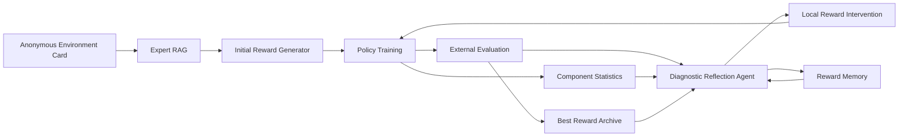

# DERES 论文与实验实施指南

## 1. 论文定位

### 推荐方法名称

**DERES: Diagnosis-guided Expert Reward Evolution Search**

中文：**诊断引导的专家知识增强奖励自进化搜索**。

当前版本不建议继续使用 `FRDE-HRDC` 作为论文主方法名。现有 v6 的主要机制是专家知识、结构化诊断、局部奖励干预、历史记忆和 best 保留，并非稳定使用训练阶段动态权重。没有充分实验时把 HRDC 写入方法名，会引入额外的动态权重贡献证明责任。

### 推荐论文标题

首选：

> **DERES: Diagnosis-Guided Expert Reward Self-Evolution with Large Language Models**

备选：

> **From Failed Rewards to Solved Policies: Diagnostic Reward Evolution with Large Language Models**

> **Expert-Knowledge-Guided Reward Function Self-Evolution for Reinforcement Learning**

中文题目：

> **基于大语言模型与结构化诊断的奖励函数自进化搜索方法**

### 一句话问题定义

现有 LLM 奖励设计通常依赖一次生成或大量候选采样，失败候选只被淘汰，没有被转化为后续设计证据。DERES 研究如何将失败奖励的训练结果转化为结构化诊断，并通过可追踪的局部干预使奖励函数持续自进化。

## 2. 核心创新点

### 贡献一：诊断引导的奖励自进化闭环

把奖励设计建模为连续闭环：

```text
奖励生成 -> 策略训练 -> 外部评估 -> 组件诊断 -> 奖励修订 -> 再训练
```

重点不是“LLM会写奖励代码”，而是失败奖励可以成为下一轮搜索的有效起点。

### 贡献二：组件级结构化训练证据

反馈同时包含：

- 外部环境累计回报；
- episode length 与终止统计；
- 奖励组件 mean、abs_mean、active rate；
- 相对主信号的量级关系；
- 历史奖励结构、修改动作与结果。

这些证据将策略训练表现映射为奖励函数层面的可操作问题。

### 贡献三：专家知识约束下的局部奖励干预

RAG 提供奖励骨架、数学形态、适用条件和风险，但不直接规定答案。Reflection Agent 默认只修改一个目标组件，以提高结果可归因性；只有诊断显示结构性失败时才更换奖励骨架。

### 贡献四：带记忆和最优保留的顺序搜索

Reward Memory 保存每轮结构、得分、关键组件和决策；best archive 防止后续探索覆盖已经找到的有效奖励。Fresh restart 用于长期停滞后的结构探索，但不得重置全局历史最优。

### RAG 是否是创新点

RAG 本身不是主要算法创新。它应被表述为 DERES 的“专家先验注入机制”。需要通过 `w/o Expert RAG` 消融证明它是否改善：

- 初始奖励质量；
- 首次解决所需轮数；
- 搜索成功率；
- 无效奖励候选数量。

## 3. Agent 定义边界

当前系统可以称为 **LLM-based reward evolution agent**，因为它具有环境事实输入、训练反馈感知、历史记忆、修改决策和代码行动闭环。

不建议称为 fully autonomous agent。当前工具调用、向量记忆和自主任务规划仍不完整。论文应明确 Agent 的动作空间是奖励函数代码修订，环境反馈来自策略训练与外部评估。

## 4. 方法架构



### 输入与输出

- Environment Card：匿名任务目标、观测动作语义、终止条件、接口约束。
- Expert RAG：任务路由与压缩后的奖励骨架知识。
- Reward Generator：生成第一版 2–4 个直接奖励组件。
- PPO Trainer：使用生成奖励训练策略。
- Evaluator：使用屏蔽的原环境奖励进行独立评估。
- Diagnostic Reflection Agent：根据代码、反馈、环境摘要和 memory 选择局部干预。
- Reward Memory：保存搜索轨迹，不保存未经验证的自然语言“结论”。

## 5. 研究问题与实验假设

### RQ1：自进化是否优于一次生成

比较 `LLM-Once` 与 DERES。主要指标是 best return、解决率和初始到最佳的配对提升。

### RQ2：结构化诊断是否提供有效搜索方向

比较 `Score-Only Evolution` 与 DERES。主要指标是首次解决轮数、无效修改比例和搜索成功率。

### RQ3：专家先验是否提高搜索效率

比较 `w/o Expert RAG` 与 DERES。分别报告初始奖励和最终奖励，避免把 RAG 与迭代贡献混在一起。

### RQ4：顺序深度搜索是否比等预算多候选搜索更有效

比较 DERES 与 `Budget-Matched Multi-Sample Search`。二者必须使用相同 LLM 调用数、奖励候选训练数和总 PPO timestep。

### RQ5：方法是否跨任务复杂度泛化

在 Env_003、Env_001 和 Env_002 上分别验证简单平衡、着陆控制和连续步态任务。

## 6. 主实验设计

### Env_001 主实验

- 方法：DERES；
- 训练 seed：5；
- 每个 seed：最多 10 轮奖励搜索；
- 每轮：1M PPO timestep；
- 搜索评估：固定 20 个评估 seed；
- 最终评估：每个训练 seed 的 best policy 使用 100 局；
- 解决阈值：外部平均回报 200；
- 报告：mean ± std、median、95% CI、解决 seed 数、Success@K、首次解决轮数。

正式实验必须冻结：代码提交、Prompt、知识库、模型版本、PPO超参数、评估seed和停止规则。

### Baseline

1. **Official-Reward PPO**：相同 PPO 配置使用官方奖励训练，作为环境可解性和性能上界参考。
2. **LLM-Once**：仅生成一次，不允许迭代。
3. **Score-Only Evolution**：保留顺序迭代，只提供外部总分、长度和终止结果。
4. **Budget-Matched Multi-Sample Search**：独立生成多个奖励，按外部得分选择，不使用诊断反馈。
5. **DERES**：完整系统。

Official-Reward PPO 不是奖励设计方法的公平对手，表格中应标记为 reference upper bound。

### 消融实验

核心消融：

1. `w/o Expert RAG`
2. `w/o Structured Diagnosis`
3. `w/o Reward Memory`
4. `w/o Local Intervention Constraint`
5. `w/o Best Retention`

资源有限时，优先前三项。暂不加入 `w/o Dynamic Weights`，除非正式方法明确包含动态权重且所有对比都遵循同一搜索预算。

### 预算公平性

每个搜索方法同时报告：

- LLM 调用次数；
- 生成并训练的奖励候选数；
- 单候选 PPO timestep；
- 总 PPO timestep；
- 首次解决前累计 timestep；
- 失败或无效代码次数。

不能只限制迭代轮数，因为多候选方法每轮可能训练多个奖励。

## 7. 跨环境实验

### Env_003：简单平衡任务

- 方法：LLM-Once、Score-Only、DERES；
- 建议 3 seed；
- 每轮 100k timestep；
- 最多 5 轮；
- 搜索阈值 475，另外报告500分满分率。

作用：证明框架在简单任务上不会因为复杂诊断而退化。它不是主要创新证据。

### Env_002：连续步态任务

- 方法：Official-Reward PPO、LLM-Once、DERES；
- 至少 3 seed，资源允许时扩展到 5 seed；
- 每轮 5M timestep；
- 最多 5 轮；
- 官方解决线 300；
- 最终 best 使用 100 局评估。

不能继续使用250作为论文 solved 标准。250可作为中间工程阈值，但图表和表格必须使用300官方线。

## 8. 统计报告规范

- 单轮搜索反馈：20局固定评估seed；
- 最终论文结果：100局评估；
- 多训练seed统计：至少5 seed用于主环境；
- 同一训练seed不同方法尽量使用相同初始化和评估seed；
- 初始与最佳奖励使用配对差值；
- 小样本优先报告bootstrap 95% CI，不只报告标准差；
- 同时报告所有seed，不隐藏失败seed；
- 提前停止的seed在后续Success@K中保持已解决状态，但原始轨迹不得伪造后续分数。

## 9. 论文图表规划

### Figure 1：系统架构图

内容：匿名环境理解、专家RAG、奖励生成、PPO训练、结构化反馈、Reflection Agent、Reward Memory、best archive和局部干预闭环。

### Figure 2：多seed奖励搜索轨迹

正式文件名：`fig02_reward_search_dynamics.pdf`

- 左图：实际候选得分；
- 右图：best-so-far；
- 画官方200分阈值；
- restart用空心菱形；
- 缺失迭代必须断线。

### Figure 3：初始到最佳的配对改善

正式文件名：`fig03_initial_to_best_improvement.pdf`

每个seed从Iter1连接到搜索best，直接回答失败初始奖励是否能被进化为有效奖励。

### Figure 4：搜索效率

正式文件名：`fig04_search_efficiency.pdf`

- Success@K累计曲线；
- 首次达到解决线的迭代分布；
- 同时报告未解决seed。

### Figure 5：诊断案例

正式文件名：`fig05_diagnostic_case_studies.pdf`

选择一个骨架重建成功案例和一个局部系数/形式调整成功案例。上半部分画得分，下半部分画组件证据，并在正文解释具体代码修改。组件热图只能说明策略访问分布下的统计变化，不能声称因果贡献。

### Figure 6：主方法与baseline

正式文件名：`fig06_method_comparison.pdf`

使用seed级散点叠加均值和95% CI，不只画柱状图。

### Figure 7：消融实验

正式文件名：`fig07_ablation_results.pdf`

同时展示best return、解决率和首次解决成本。

### Figure 8：跨环境泛化

正式文件名：`fig08_cross_environment_generalization.pdf`

不同环境分数尺度不同，使用归一化指标：

```text
normalized_score = score / official_solved_threshold
```

同时保留附表中的原始分数。

## 10. 当前 v6 探索性图

代码：`analysis/paper/`

数据输出：`artifacts/paper/v6_exploratory/`

图片输出：`figures/paper/v6_exploratory/`

当前生成：

- `fig01_reward_search_dynamics.{png,pdf}`
- `fig02_initial_to_best_improvement.{png,pdf}`
- `fig03_search_efficiency.{png,pdf}`
- `fig04_diagnostic_case_studies.{png,pdf}`

v6 seed0–6共观察到48个有效迭代记录，其中6/7个seed曾达到200分。所有轮次仅使用10局评估，seed4缺失Iter3；历史实现还存在restart best bookkeeping问题。因此这些图用于验证分析代码和展示研究动机，不作为最终投稿结果。

生成命令：

```powershell
C:\ProgramData\miniconda3\envs\eure\python.exe -m analysis.paper.collect_v6_results
C:\ProgramData\miniconda3\envs\eure\python.exe -m analysis.paper.generate_v6_figures
```

## 11. 论文结构

### 1 Introduction

- 奖励函数决定策略学习目标，但人工设计成本高；
- LLM具备奖励设计先验，但一次生成和大量采样不能充分利用失败经验；
- 提出诊断引导的奖励自进化搜索；
- 列出三到四项贡献。

### 2 Related Work

- reward shaping与potential-based shaping；
- automated reward design；
- LLM-generated reward；
- agentic reward optimization与代码搜索；
- 与种群式搜索、一次生成和结构搜索的差异。

### 3 Method

- 问题定义；
- 匿名环境理解；
- 专家知识检索；
- 初始奖励生成；
- 组件级反馈；
- 诊断与局部干预；
- memory、best retention和restart；
- 算法伪代码。

### 4 Experiments

- 环境和PPO设置；
- baseline与预算；
- 主结果；
- 搜索动态；
- 消融；
- 跨环境；
- 成本分析；
- 案例研究。

### 5 Discussion

- LLM先验与框架贡献的边界；
- 已知benchmark记忆风险；
- 组件统计不是因果贡献；
- 训练成本和搜索失败；
- 自定义未见环境作为后续验证。

### 6 Conclusion

总结诊断证据、顺序局部干预和奖励自进化的价值，不宣称发明新的奖励数学公式。

## 12. 论文中应避免的表述

不要写：

- “RAG本身是全新的奖励设计算法”；
- “组件mean证明某组件具有因果贡献”；
- “一次seed成功证明方法泛化”；
- “250分解决BipedalWalker”；
- “LLM没有见过匿名benchmark”；
- “框架完全模拟了人类专家大脑”。

建议写：

- “结构化组件证据为后续奖励干预提供可操作线索”；
- “匿名化降低直接名称提示，但不能排除模型通过接口特征识别benchmark”；
- “多seed结果表明顺序迭代能够将多个失败初始奖励转化为达到任务阈值的奖励”；
- “等预算实验用于评估深度诊断搜索相对于独立候选采样的效率”。

## 13. 实施顺序

1. 冻结最终Prompt、知识库、反馈格式和best/restart逻辑。
2. 完成Env_003工程smoke test。
3. 在Env_001运行完整DERES 5-seed主实验。
4. 运行LLM-Once和Score-Only两个关键baseline。
5. 运行w/o RAG、w/o diagnosis、w/o memory消融。
6. 对所有Env_001 best执行100局最终评估。
7. 完成Env_002三seed正式实验，阈值改为300。
8. 将新实验注册到manifest，重新生成正式论文图表。
9. 最后撰写结果章节，禁止先写结论再选择实验。
