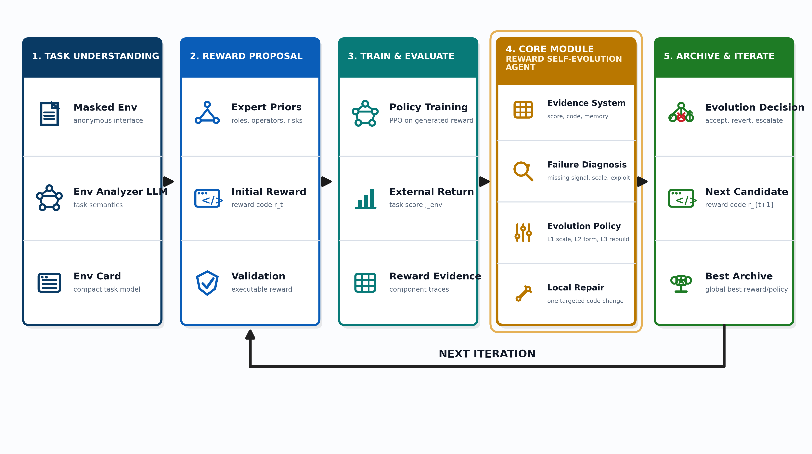
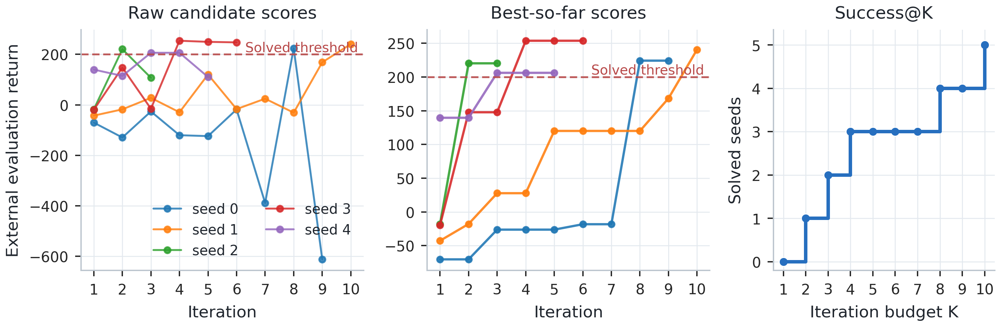
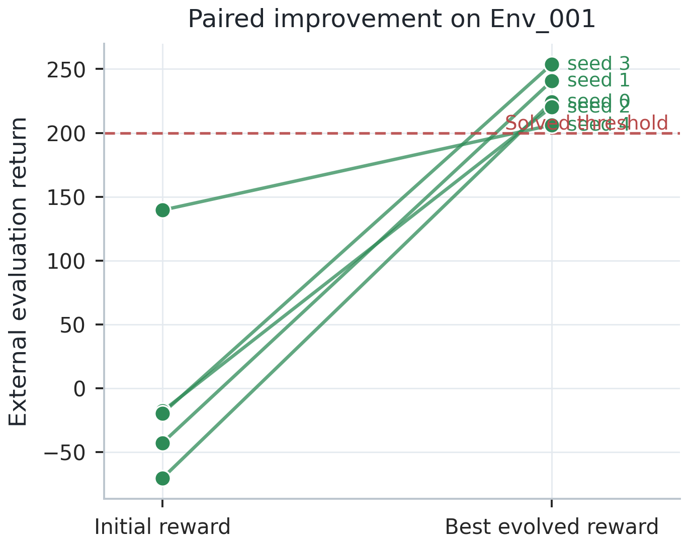
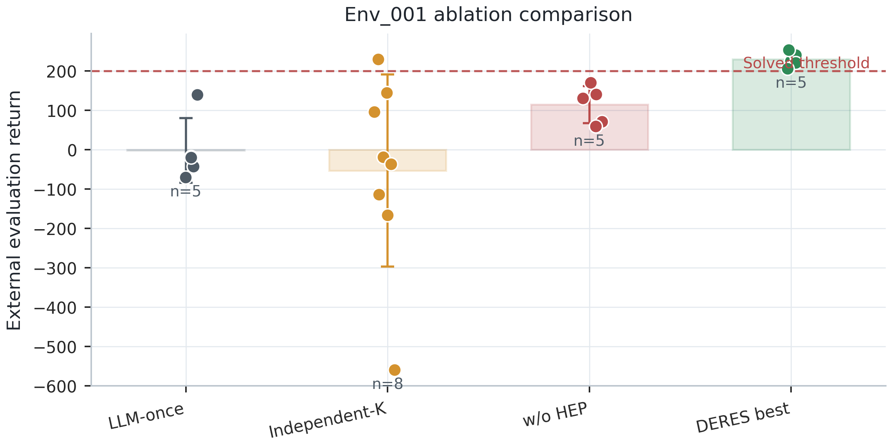
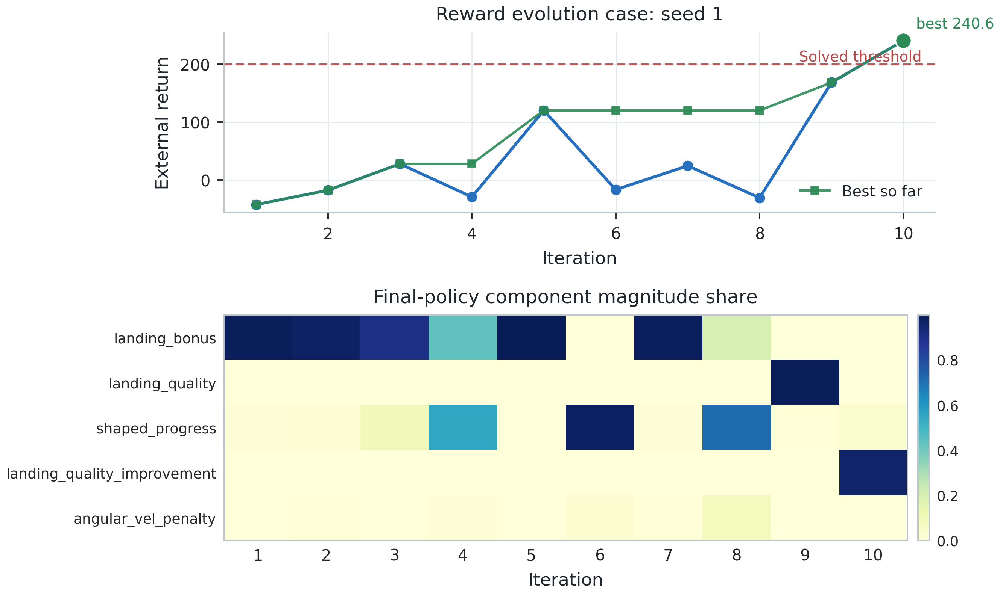
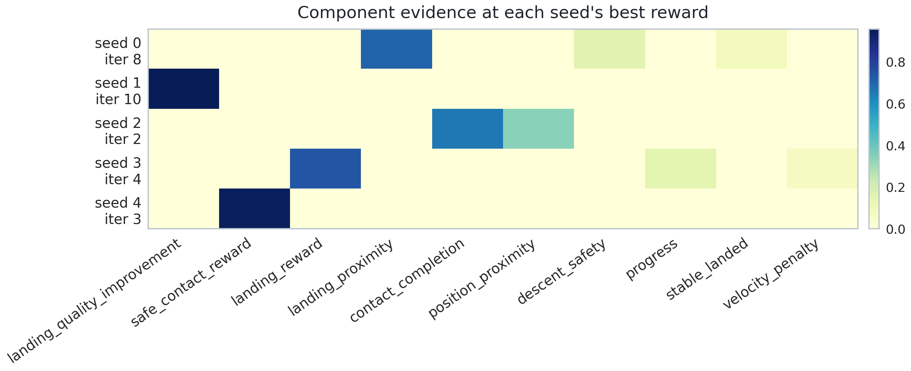
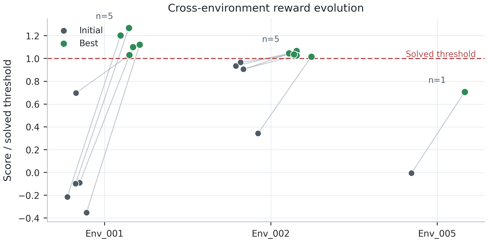
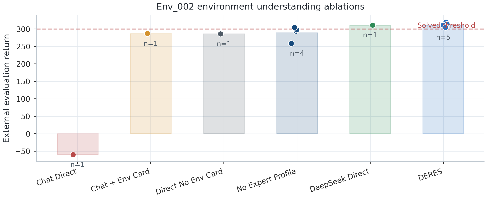
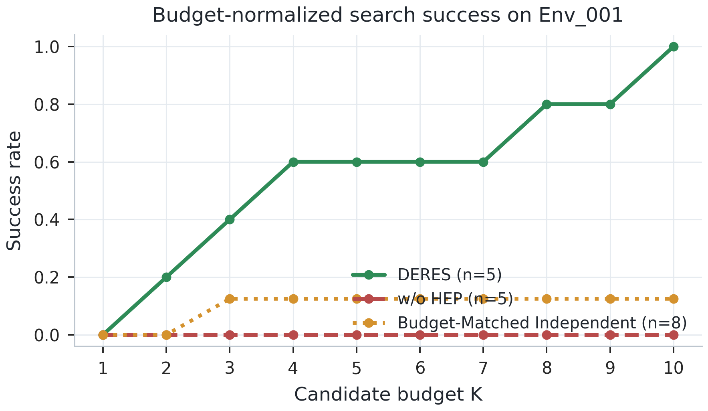

# DERES 论文粗稿 v0：诊断驱动的奖励函数自进化搜索

> 说明：本文档是内容粗稿，不是最终论文格式稿。重点是先把研究故事、方法论、相关工作边界、实验叙事和图表设计立起来。后续可以再交给论文排版/润色流程改成会议论文格式。

## 拟定标题

**From Failed Rewards to Solved Policies: Diagnosis-Guided Reward Function Self-Evolution with Large Language Models**

中文标题可写为：

**从失败奖励到可解策略：基于大语言模型的诊断驱动奖励函数自进化搜索**

备选标题：

- **DERES: Diagnosis-Guided Reward Function Self-Evolution for Reinforcement Learning**
- **Structured Reward Function Self-Evolution for Reinforcement Learning via Diagnostic Language Agents**
- **Turning Failed Rewards into Search Evidence: A Diagnostic Language Agent for Reward Function Evolution**

## 摘要草稿

奖励函数设计是强化学习应用中的核心瓶颈。传统奖励函数往往依赖专家经验和反复试错，而奖励设计中的尺度失衡、稀疏反馈、代理目标错位和奖励漏洞会显著影响策略学习。近年来，大语言模型被用于自动生成奖励函数代码，并在机器人控制和连续控制任务中取得了进展。然而，现有方法多强调一次性奖励生成、种群式奖励搜索或基于粗粒度训练反馈的迭代改写，失败奖励候选通常被视为低质量样本而被丢弃，未能充分转化为下一轮搜索的诊断证据。

本文提出 **DERES**，一种诊断驱动的奖励函数自进化搜索框架。DERES 将奖励函数设计建模为一个闭环的语言智能体过程：首先由环境理解 LLM 将匿名环境接口、观测空间、动作空间和 masked step 函数压缩为 environment card；随后生成初始奖励函数；再通过 PPO 训练策略并使用外部环境分数进行评估；最后将外部分数、episode 结果、奖励组件统计、历史奖励记忆、上一轮代码和全局最优代码组织为 Reward Evidence System，供奖励进化 Agent 进行诊断。与无约束的多轮改写不同，DERES 使用层级化奖励演化策略，将每轮干预划分为尺度修复、数学结构变换和奖励骨架重建三个层级，并在正常模式下坚持单组件局部修复，使奖励修改过程更可归因、更稳定。

在 Env_001 的 5-seed 主实验中，LLM 初始奖励函数 0/5 达到 solved threshold，而 DERES 在最多 10 轮内将 5/5 个 seed 全部搜索到可解奖励函数，best score 从 Iter1 的 -2.21±73.38 提升到 228.98±16.54。去除层级化演化策略后，Env_001 的 unconstrained sequential 消融在 5 个 seed 中均未达到解决分数，表现出明显震荡。进一步地，Env_002 的连续控制步态任务 5/5 seed 达到 solved threshold，Env_005 的高维多足连续控制案例从 -12.04 提升到 1414.47，表明该框架具有跨任务迁移潜力。实验说明，DERES 的核心价值不在于单次生成一个好奖励函数，而在于将失败奖励转化为结构化诊断证据，并通过深度反思式的局部奖励修复实现奖励函数自进化。

关键词：强化学习；奖励函数设计；大语言模型；奖励塑形；自进化搜索；语言智能体

## 1. 引言草稿

强化学习通过最大化累积奖励来学习策略，因此奖励函数在很大程度上决定了智能体最终学到的行为。一个看似合理的奖励函数可能在优化过程中诱导完全错误的策略，例如停滞、震荡、投机取巧、过度保守或利用代理目标漏洞。对于复杂连续控制任务，奖励函数通常需要同时处理任务进展、稳定性、安全约束、动作代价、终端成功信号和阶段性目标。如何把人类意图转化为可学习、尺度合理、抗利用的奖励函数，一直是强化学习从基准任务走向真实应用的关键难题。

传统奖励函数设计主要依赖人工专家经验。专家会根据环境状态、动作含义和终止条件手工设计进展奖励、势能塑形、存活奖励、动作惩罚、接触奖励、阶段奖励或动态权重等组件，并通过多轮训练结果不断调试。然而，这一过程成本高、可复用性低，并且需要设计者具有丰富的任务理解和奖励调参经验。理论上，potential-based reward shaping 能够在一定条件下保持最优策略不变，但真实任务中的奖励函数通常由多个 proxy 组件组合而成，很难仅靠单一理论公式解决所有问题。

大语言模型为奖励函数设计带来了新的可能。近期工作已经表明，LLM 能够根据自然语言任务描述、环境接口或代码片段生成可执行奖励函数，并在多个机器人控制任务中接近甚至超过人工奖励。然而，奖励函数生成并不等于奖励函数搜索。对于一个初始失败的奖励函数，真正困难的问题是：如何判断失败原因，如何选择修改层级，如何避免一次修改过多导致归因混乱，如何利用历史失败而不是简单丢弃它们。

现有 LLM 奖励设计方法大致有三类。第一类强调一次性生成或少量人工反馈修正，例如从语言目标生成 dense reward code。第二类强调进化式或种群式搜索，通过生成多个奖励函数候选，训练策略并选择表现较好的奖励。第三类将奖励设计视为更复杂的 agentic search，例如用 MCTS 管理奖励设计路径，或通过视觉模型分析策略轨迹中的语义失败。这些工作显著推动了自动奖励设计，但仍存在一个空白：如何在单条奖励函数主线上，将每一次失败训练转化为可读、可诊断、可归因的下一轮奖励修复证据。

本文提出 DERES，即 Diagnosis-guided Reward Function Self-Evolution with Large Language Models。我们的观点是：失败奖励函数不应只是搜索中的废样本，而应成为下一轮奖励修复的诊断证据。DERES 将奖励设计过程组织为一个奖励设计语言智能体。该 Agent 具备四类能力：感知环境接口和训练反馈，维护奖励搜索记忆，规划奖励修改层级，并通过代码生成执行局部奖励修复。与种群式“题海战术”不同，DERES 关注一条奖励函数 lineage 的深度反思式演化：从当前失败奖励出发，分析策略学到了什么、奖励组件如何影响行为、当前设计缺少哪类信号或数学结构，再选择最小但有方向的干预。

本文的主要贡献如下：

1. **提出奖励函数自进化搜索视角。** 本文将奖励设计建模为从低质量初始奖励出发的闭环自进化过程，而非一次性奖励生成或独立候选采样。

2. **构建 Reward Evidence System。** 我们将外部任务分数、episode 结果、奖励组件贡献、激活率、历史奖励记忆、上一轮奖励代码和全局最优奖励代码组织为结构化证据，使 LLM 的反思不再只依赖粗粒度得分。

3. **提出层级化奖励演化策略。** DERES 将奖励干预划分为 L1 尺度修复、L2 数学结构变换和 L3 奖励骨架重建，并在正常模式下执行单组件局部修复，从而提高修改可归因性并降低无约束 LLM 迭代震荡。

4. **在多类连续控制任务上验证有效性。** Env_001 主实验显示 DERES 能将 5 个 seed 的未解决初始奖励全部演化到 solved threshold；消融实验表明去除层级化演化策略会导致搜索震荡和失败；Env_002 与 Env_005 进一步展示了跨任务泛化潜力。

## 2. 相关工作草稿

### 2.1 传统奖励设计与奖励塑形

奖励函数设计长期以来是强化学习中的核心问题。标准 RL 将奖励视为给定信号，但在实际任务中，奖励函数往往需要设计者将任务意图转化为可优化的标量反馈。经典工作中，Ng 等提出 potential-based reward shaping，证明形如势能差的奖励塑形在一定条件下能够保持最优策略不变。这一理论解释了为什么“靠近目标”“降低速度”“改善姿态”等进展信号常被写成状态势能差。

除了势能塑形，实践中还常见多种奖励设计手段，包括稠密进展奖励、终端成功奖励、存活奖励、动作代价、阶段奖励、动态权重、门控约束和多目标加权。Reward Machines 进一步将奖励函数表示为有限状态机，使奖励结构可见，并支持任务分解、自动奖励塑形和反事实推理。Inverse Reward Design 则指出人工奖励本质上只是设计者真实目标的一个 proxy，在训练环境之外可能发生 reward misspecification 或 reward hacking。

这些传统方法说明奖励函数设计并不是简单写一个公式，而是涉及任务对齐、信号可达性、尺度平衡、信用分配和抗利用性等多方面考虑。DERES 继承这些专家设计思想，但目标不是提出新的单一奖励公式，而是让 LLM Agent 在奖励搜索过程中自动判断何时需要尺度修复、何时需要结构变换、何时需要骨架重建。

相关文献包括：

- Ng, Harada, Russell, potential-based reward shaping.
- Wiewiora, reward shaping and Q-value initialization.
- Icarte et al., Reward Machines.
- Hadfield-Menell et al., Inverse Reward Design.
- Mindermann et al., Active Inverse Reward Design.
- Parker-Holder et al., AutoRL survey.

### 2.2 LLM 一次性奖励生成

随着 LLM 的代码生成和语义理解能力提升，研究者开始使用 LLM 自动生成奖励函数。Language to Rewards 将奖励函数作为连接高层语言指令与低层机器人控制的中间接口。Text2Reward 从自然语言目标生成 dense reward code，并在 ManiSkill2、MetaWorld 和 MuJoCo 等任务上验证了 LLM 生成奖励的有效性。Self-Refined LLM Reward Designer 进一步将初始奖励生成与性能反馈结合，用 LLM 进行自我修正。

这些工作证明了 LLM 能够写出可执行奖励代码，并将专家经验转化为 reward shaping 形式。与这些方法相比，DERES 不把研究重点放在“LLM 能否生成奖励函数”上，因为这一点已有充分工作覆盖。DERES 关注的是：当初始奖励函数失败时，如何通过结构化证据和层级化反思把它一步步修复，而不是重新生成大量独立候选。

相关文献包括：

- Yu et al., Language to Rewards for Robotic Skill Synthesis.
- Xie et al., Text2Reward.
- Song et al., Self-Refined LLM as Automated Reward Function Designer.

### 2.3 LLM 迭代式与进化式奖励搜索

Eureka 是 LLM 奖励设计方向的重要工作，它使用 GPT-4 进行 reward code 的进化式优化，在 29 个开源 RL 环境中取得优于人工奖励的结果。CARD 使用 Coder-Evaluator 框架与动态反馈，加入 process feedback、trajectory feedback 和 trajectory preference evaluation，以降低每轮都进行 RL 训练的成本。面向自动驾驶和协同车队的工作也使用 LLM 生成并迭代优化奖励函数，说明 LLM reward evolution 已经成为一个活跃方向。

这些方法通常会生成多个候选奖励或通过较宽的搜索策略探索奖励空间。它们的优势是覆盖面大，但也可能带来搜索成本高、历史失败利用不充分、修改路径难解释的问题。DERES 与这类方法的核心区别在于：我们不是把失败奖励当作被淘汰的候选，而是把它转化为下一轮局部修复的证据；不是依赖种群式宽搜索，而是强调单条奖励主线上的深度诊断和可归因修改。

相关文献包括：

- Ma et al., Eureka.
- Sun et al., CARD.
- Han et al., highway driving reward generation and evolution.
- Wei et al., LLM-based reward design for cooperative platoon coordination.

### 2.4 Agentic Reward Design 与语义诊断

近期工作开始将奖励设计进一步 agent 化。RF-Agent 将奖励函数设计建模为 sequential decision-making process，并使用 MCTS 管理奖励设计和优化过程，以更好利用历史信息。RDA 使用 VLM 视觉理解策略轨迹，进行任务分解、视觉失败诊断和奖励代码修订，以解决仅凭成功率等粗粒度反馈难以判断行为语义的问题。LIMEN 进一步将问题扩展到 RL interface discovery，不仅演化奖励程序，也探索 observation interface。

这些工作说明“奖励设计 agent”已经是明显趋势。DERES 可以被称为 agent，但需要准确限定：它不是通用自主智能体，也不是 MCTS 搜索 agent，而是面向奖励函数设计的诊断式语言智能体。DERES 的感知来自环境卡和训练证据，记忆来自 reward memory 和 best archive，规划来自 L1/L2/L3 演化策略，行动是生成下一版 reward code。与 RF-Agent 的树搜索和 RDA 的视觉语义诊断不同，DERES 聚焦在结构化 reward evidence 和单主线局部奖励修复：它研究的是如何让一条失败 reward lineage 通过深度反思逐步变好。

相关文献包括：

- Gao et al., RF-Agent.
- Lee et al., RDA.
- LIMEN / Discovering Reinforcement Learning Interfaces with LLMs.

### 2.5 本文定位

综上，已有工作已经覆盖了 LLM 一次性奖励生成、LLM 迭代奖励优化、动态反馈、MCTS 搜索、视觉失败诊断和接口进化。因此，DERES 不应声称“首次使用 LLM 设计奖励函数”，也不应声称“首次进行奖励函数迭代”。本文的定位是：

> DERES studies reward design as a diagnosis-guided single-lineage self-evolution process. It converts failed reward-training outcomes into structured evidence and uses hierarchical, attributable local reward repair to evolve reward functions from poor initial designs to solved policies.

换言之，本文的研究贡献不在于“生成更多奖励候选”，而在于“更深地理解一个失败奖励为什么失败，并沿着可解释的路径修复它”。

## 3. 方法草稿

### 3.1 问题定义

给定一个匿名强化学习环境，其可用信息包括任务描述、观测空间、动作空间、masked step source 和 reward 函数接口：

```python
def compute_reward(obs, action, next_obs, original_reward, info, training_progress=0.0):
    ...
```

目标是自动搜索一个生成奖励函数 \(R_t\)，用于训练策略 \(\pi_t\)，使得策略在外部环境评价分数 \(J_{\mathrm{env}}(\pi_t)\) 上达到或超过 solved threshold。注意，生成奖励函数不能直接使用 `original_reward` 或官方 reward 组件；外部环境分数只用于评估和搜索反馈，不参与策略训练奖励。

我们将奖励函数搜索过程表示为：

\[
R_t \rightarrow \mathrm{Train}(\pi_t | R_t) \rightarrow E_t \rightarrow \mathrm{Agent}(R_t, E_t, M_t) \rightarrow R_{t+1},
\]

其中 \(E_t\) 是第 \(t\) 轮训练后得到的证据，\(M_t\) 是历史搜索记忆。DERES 的核心是学习如何从 \(E_t\) 中诊断奖励失败原因，并生成有方向的奖励修复。

### 3.2 框架总览

**图 1 建议画法：DERES 闭环框架图。**

建议图中包含五个高层模块：

1. **Masked Environment Interface**  
   输入匿名任务说明、observation/action space、masked step source。

2. **Environment Understanding LLM**  
   输出 environment card，包括任务目标、变量语义、可用信号、禁用信号、终止条件、潜在 failure modes。

3. **Initial Reward Synthesis**  
   根据 environment card 将 reward role 映射到 usable signal 和 formula operator，生成初始奖励函数 \(R_1\)。

4. **Policy Training and Reward Evidence System**  
   使用生成奖励训练 PPO 策略，并用外部环境分数评估；同时记录 score、episode outcome、component evidence、reward memory、previous reward 和 best reward。

5. **Hierarchical Reward Evolution Agent**  
   读取证据，诊断失败，选择 L1/L2/L3 干预层级，执行局部修复或骨架重建，生成 \(R_{t+1}\)。

图中应避免出现 API、prompt 文件名、TensorBoard、VecNormalize、代码校验等工程细节。图的重点是奖励函数自进化闭环，而不是工程流水线。

### 3.3 Environment Understanding LLM

Environment Understanding LLM 的职责不是生成奖励代码，而是将环境接口转化为 reward design 所需的任务语义。它读取匿名任务描述、观测空间、动作空间和 masked step source，并输出 environment card。该卡片包括：

- 任务目标与不应混淆的次要目标；
- observation index 的语义和是否可用于 reward；
- action 维度含义；
- success-like、failure-like 和 ambiguous termination；
- 可用信号与禁用信号；
- reward role decomposition；
- role-to-signal mapping；
- 训练后应观察的 failure modes。

这一模块的意义是降低 LLM 对环境接口的误读。特别是在匿名环境中，reward generator 不能依赖真实 Gym 名称或官方奖励记忆，而必须根据显式可用信号设计奖励。

### 3.4 Initial Reward Synthesis

初始奖励生成模块采用 role → signal → formula operator → code 的流程。首先根据 environment card 确定奖励职责，例如：

- 主学习信号：任务进展、目标接近、前进速度；
- 稳定/安全约束：姿态、速度、高度、接触、越界；
- 效率约束：动作能耗、平滑性；
- 任务完成 proxy：在没有显式 success flag 时提供连续完成近似；
- 慎用项：终端奖励、复杂门控、动态课程等。

随后，LLM 为每个职责选择数学结构，例如：

- 状态值奖励；
- 状态改善奖励；
- potential-based shaping；
- bounded continuous proxy；
- hinge penalty；
- local gate；
- multiplicative joint satisfaction；
- curriculum weighting。

初始奖励函数推荐保持 2-4 个核心组件，但这不是机械限制，而是为了避免初始 reward 过度复杂，降低后续诊断难度。

### 3.5 Reward Evidence System

DERES 的关键不是只把最终 score 反馈给 LLM，而是构造结构化证据。每轮训练结束后，系统固定评估 seed，用外部环境 reward 评估策略，并记录：

- mean external score；
- episode length；
- terminated/truncated 统计；
- score range；
- reward component episode_sum_mean；
- signed share；
- magnitude share；
- active rate；
- reward error count；
- reward memory；
- previous reward code；
- best reward code。

这些证据将“训练失败”转化为可分析对象。例如，若 episode 很短且 score 很低，可能是早期失败或 crash；若 episode 很长但 score 低，可能是存活但无进展；若某个惩罚组件 magnitude share 过大，可能压制探索；若某个 proxy active rate 很低，可能是稀疏信号不起作用；若修改后 best 下降，则应比较 previous reward 与 best reward 的结构差异。

需要强调的是，组件统计不是严格因果贡献，而是 observed reward composition。DERES 使用它作为诊断证据，而不是单独凭比例作出结论。

### 3.6 Hierarchical Reward Evolution Agent

Hierarchical Reward Evolution Agent 是 DERES 的核心。它将每次奖励修改划分为三个层级。

**L1: Scale Repair.**  
当奖励职责完整、数学结构合理，但某些组件尺度异常时，执行系数、阈值或权重微调。例如，稳定惩罚过强会使 agent 不敢行动，动作惩罚过强会导致保守策略，completion proxy 过弱则无法影响学习。

**L2: Structural Transformation.**  
当问题来自数学形态而非系数时，执行结构变换。常见变换包括：

- 稀疏信号 → 稠密连续信号；
- 二值条件 → bounded continuous factor；
- 无界奖励 → 有界奖励；
- 绝对状态值 → 状态改善量；
- 全局惩罚 → 局部门控惩罚；
- 加权和 → 乘积或几何平均，以表达联合满足；
- 持续奖励 → 转移事件奖励；
- proxy 目标 → 更接近任务完成的信号。

**L3: Skeleton Rebuild.**  
当同一奖励家族多轮迭代仍不能产生实质改善，或历史记录显示多个局部修复预测失败时，Agent 进入骨架重建模式。此时不再受上一轮奖励结构约束，而是基于环境事实、失败历史和公式算子库重新选择主信号框架。

DERES 在正常模式下每轮只修改一个目标组件。这个约束看似保守，但它能让下一轮训练结果更容易归因。如果同时改三个组件，得分变化无法判断是哪一个修改导致。消融实验表明，无约束顺序改写容易出现过度修改和震荡，难以稳定达到 solved threshold。

### 3.7 自进化循环

正式论文中建议把 DERES 的闭环过程同时写成数学形式和伪代码。数学形式体现方法的抽象性，伪代码体现流程的可复现性。二者搭配会比单纯用自然语言描述更像一篇完整的方法论文。

给定一个环境 \(\mathcal{E}\)，其真实环境奖励 \(r_{\mathrm{env}}\) 仅用于外部评价，不直接用于训练奖励生成。第 \(t\) 轮 LLM 生成的奖励函数记为 \(R_t\)，用其训练得到策略：

\[
\pi_t = \mathrm{Train}(R_t),
\]

并用外部评价函数得到任务表现：

\[
s_t = J_{\mathrm{env}}(\pi_t).
\]

每轮训练后，系统构造结构化证据：

\[
E_t = \{s_t, L_t, O_t, C_t, R_t, R_{\mathrm{best}}, M_t\},
\]

其中 \(L_t\) 表示 episode length 等轨迹统计，\(O_t\) 表示 terminated/truncated 等 episode outcome，\(C_t\) 表示奖励组件证据，\(R_{\mathrm{best}}\) 表示当前全局最优奖励函数，\(M_t\) 表示历史奖励记忆。Reward Evolution Agent 根据证据选择干预层级：

\[
z_t = g_{\phi}(E_t, M_t), \quad z_t \in \{\mathrm{L1}, \mathrm{L2}, \mathrm{L3}\},
\]

并生成下一轮奖励函数：

\[
R_{t+1} = h_{\phi}(R_t, E_t, M_t, z_t).
\]

最终输出为搜索过程中外部评价分数最高的奖励函数和策略：

\[
(R^\*, \pi^\*) = \arg\max_{t \le K} J_{\mathrm{env}}(\pi_t).
\]

**Algorithm 1 建议写法：DERES reward self-evolution.**

```text
Input:
  Masked environment interface I
  Target score q
  Maximum iterations K
  Training budget B per candidate reward

Output:
  Best reward function R*
  Best policy pi*

1:  c <- EnvironmentUnderstandingLLM(I)
2:  R_1 <- InitialRewardSynthesis(c)
3:  M_0 <- empty reward memory
4:  R* <- R_1, pi* <- null, s* <- -infinity

5:  for t = 1 ... K do
6:      pi_t <- TrainPolicy(R_t, budget = B)
7:      s_t, O_t, C_t <- ExternalEvaluate(pi_t, R_t)
8:      E_t <- BuildEvidence(s_t, O_t, C_t, R_t, R*, M_{t-1})
9:      M_t <- UpdateMemory(M_{t-1}, E_t)

10:     if s_t > s* then
11:         R* <- R_t, pi* <- pi_t, s* <- s_t
12:     end if

13:     if s* >= q then
14:         return R*, pi*
15:     end if

16:     z_t <- SelectInterventionLevel(E_t, M_t)
17:     if z_t = L1 then
18:         R_{t+1} <- ScaleRepair(R_t, E_t, M_t)
19:     else if z_t = L2 then
20:         R_{t+1} <- StructuralTransform(R_t, E_t, M_t)
21:     else
22:         R_{t+1} <- SkeletonRebuild(c, E_t, M_t)
23:     end if
24:  end for

25:  return R*, pi*
```

这段伪代码在论文里不需要暴露 prompt 文件、API 调用、retry、日志路径、TensorBoard、VecNormalize 等工程细节。算法层面只保留五个关键动作：理解环境、生成奖励、训练评估、构造证据、层级化修复。

这一过程中的“自进化”不是生物学意义的种群演化，而是奖励函数沿着一条历史主线，通过环境证据和训练反馈不断自我修复。DERES 也可被称为 reward-design agent，因为它具有感知、记忆、规划和行动：感知环境卡与训练证据，维护奖励记忆，规划干预层级，执行奖励代码修复。

## 4. 实验设置草稿

### 4.1 实验问题

实验围绕四个问题展开：

1. DERES 能否从低质量初始奖励函数出发，搜索到可解奖励函数？
2. DERES 的收益是否来自自进化，而非一次生成？
3. DERES 的层级化演化策略是否必要？
4. DERES 是否能迁移到不同类型的连续控制环境？

### 4.2 环境与训练设置

**Env_001.** 主实验环境，solved threshold 为 200。每个奖励候选使用 PPO 训练 1M steps，评估 20 episodes，最多 10 轮，5 个 seed。

**Env_002.** 连续控制步态任务，solved threshold 为 300。每个奖励候选使用 PPO 训练 5M steps，评估 20 episodes，最多 10 轮，5 个 seed。

**Env_005.** 高维多足连续控制任务，当前项目配置使用 Ant-v4，target score 为 2000。每个奖励候选使用 PPO 训练 1M steps，评估 20 episodes。该实验目前作为复杂控制 case study。

### 4.3 Baselines 与消融

建议论文中使用以下对照：

1. **LLM-once.** 只使用初始奖励函数，不进行后续自进化。可直接使用 DERES 主实验的 Iter1。

2. **w/o Hierarchical Evolution Policy.** 保留顺序迭代、反馈、memory 和 best archive，但取消 L1/L2/L3 层级选择和单组件局部修复约束。对应当前 `ablation_unconstrained_v4`。

3. **Budget-Matched Independent Search.** 使用相同训练预算生成 K 个独立奖励函数，每个候选不利用前一轮失败证据。该实验建议补充，因为它能直接证明 DERES 不是“多采样碰运气”，而是“利用失败证据进行顺序自进化”。

4. **w/o Environment Understanding LLM.** 不生成 environment card，直接让模型从原始输入生成奖励。Env_002 上已有初步证据，特别适合说明环境理解模块对较弱模型的稳定化作用。

5. **Score-only Feedback.** 只给总分和 episode length，不给组件证据、best code 和 reward memory。该实验可作为 Reward Evidence System 的消融，但优先级低于 Budget-Matched Independent Search。

## 5. 实验结果草稿

### 5.1 Env_001 主实验：从失败奖励到可解策略

Env_001 是本文最关键的主实验。结果如下：

| seed | Iter1 score | Best score | Best iter | Solved |
|---:|---:|---:|---:|:---:|
| 0 | -70.35 | 224.21 | 8 | yes |
| 1 | -42.74 | 240.60 | 10 | yes |
| 2 | -17.90 | 220.24 | 2 | yes |
| 3 | -19.59 | 253.71 | 4 | yes |
| 4 | 139.53 | 206.14 | 3 | yes |

汇总：

| Metric | Value |
|---|---:|
| Iter1 mean ± std | -2.21 ± 73.38 |
| Best mean ± std | 228.98 ± 16.54 |
| Solved seeds | 5/5 |

该结果说明，LLM 初始生成的奖励函数并不稳定，5 个 seed 均未达到 solved threshold。然而 DERES 通过最多 10 轮诊断式自进化，将所有 seed 都搜索到可解奖励函数。这直接支持本文核心观点：失败初始奖励并不意味着搜索失败，只要将训练结果转化为结构化证据，奖励函数可以沿着一条可解释的路径被逐步修复。

**图 2 建议：Env_001 每个 seed 的 score trajectory 与 best-so-far trajectory。**  
左图画每轮实际 score，右图画 best-so-far score，并加 solved threshold=200 的水平线。

**图 3 建议：Initial-to-best slope chart。**  
每个 seed 一条线，从 Iter1 连到 best，突出所有 seed 从未解决到解决。

### 5.2 LLM-once 对比：单次生成不足以解决 Env_001

LLM-once 使用 DERES 主实验的 Iter1 作为结果：

| seed | LLM-once score | Solved |
|---:|---:|:---:|
| 0 | -70.35 | no |
| 1 | -42.74 | no |
| 2 | -17.90 | no |
| 3 | -19.59 | no |
| 4 | 139.53 | no |

LLM-once 在 Env_001 中 0/5 solved，而 DERES 最终 5/5 solved。这说明 DERES 的收益不是来自一次 LLM 生成，而来自后续奖励自进化搜索。

### 5.3 w/o Hierarchical Evolution Policy：无约束顺序改写会震荡

在 `ablation_unconstrained_v4` 中，系统保留顺序迭代和反馈，但去除 L1/L2/L3 层级策略与单组件修复约束。结果如下：

| seed | Iter1 score | Best score | Solved |
|---:|---:|---:|:---:|
| 0 | -121.66 | 169.90 | no |
| 1 | -107.52 | 130.64 | no |
| 2 | -111.84 | 71.06 | no |
| 3 | -10.16 | 59.18 | no |
| 4 | -101.89 | 140.27 | no |

该消融 0/5 solved，明显低于 DERES 的 5/5 solved。更重要的是，轨迹中出现多次大幅退化和震荡，说明简单“让 LLM 看反馈然后继续改”并不足以稳定搜索奖励函数。DERES 的层级化演化策略提供了必要的修改边界：先检查信号是否齐全，再进行尺度修复；尺度修复不足时再进行结构变换；多轮失败后才重建骨架。这个机制使一条单线 reward lineage 不至于陷入无方向的反复试错。

**图 4 建议：DERES vs w/o HEP 的 best-so-far 对比。**  
每个方法画 5 个 seed 的 best-so-far，或画 success@iteration。

### 5.4 Env_002 泛化实验：连续控制步态任务

Env_002 主实验结果：

| seed | Iter1 score | Best score | Best iter | Solved |
|---:|---:|---:|---:|:---:|
| 0 | 270.71 | 320.02 | 4 | yes |
| 1 | 280.50 | 313.73 | 3 | yes |
| 2 | 272.07 | 307.92 | 2 | yes |
| 3 | 289.99 | 311.12 | 2 | yes |
| 4 | 103.03 | 304.92 | 3 | yes |

汇总：

| Metric | Value |
|---|---:|
| Iter1 mean ± std | 243.26 ± 70.45 |
| Best mean ± std | 311.54 ± 5.17 |
| Solved seeds | 5/5 |

该实验说明 DERES 在连续控制步态任务上也能生成可解奖励函数。但需要谨慎表述：Env_002 中 4 个 seed 的初始奖励已经较强，因此它更适合作为跨任务有效性证据，而不是主要证明“坏奖励修复”的实验。seed4 从 103.03 提升到 304.92，可以作为低质量初始奖励被修复的补充案例。

### 5.5 Environment Understanding 消融：环境卡是稳定化模块

Env_002 上已有若干环境理解相关记录：

| Experiment | Model / Setting | Env card | Expert prior | Score | Note |
|---|---|:---:|:---:|---:|---|
| ablation_direct_no_env_card_v1 | direct generation | no | unclear | 286.12 | 未 solved |
| ablation_direct_no_expert_v2 | DeepSeek-v4-pro | no | no | 311.33 | solved |
| ablation_direct_no_expert_v3_chat | deepseek-chat | no | no | -59.76 | failed |
| test_chat_with_env_card | deepseek-chat | yes | yes | 286.83 | 明显恢复但未 solved |
| ablation_no_expert_profile_v1 | facts-only env analyzer | yes | yes | 288.89 ± 17.75 | 4 seed, 1/4 solved |

这些结果不能简单写成“环境卡总是提高强模型上限”。更准确的结论是：对于 DeepSeek-v4-pro 这类强模型，Env_002 的 locomotion 结构相对直接，即使没有环境卡也可能生成可解奖励；但对于 deepseek-chat，缺少环境理解时奖励设计失败，而加入 environment card 后分数明显恢复。这说明 Environment Understanding LLM 更像稳定化模块：它通过任务语义压缩和观测-目标对齐，降低弱模型或不稳定生成条件下的误解风险。

**图 5 建议：Env_002 环境理解消融柱状图。**  
横轴为 direct no-card、pro no-card/no-expert、chat no-card/no-expert、chat+env-card、full DERES，纵轴为 external score。

### 5.6 Env_005 复杂控制案例：高维多足任务上的自进化

Env_005 当前最好的实验记录是 `paper_ant_v7/seed_0`。Reward memory 显示：

| Iter | Score | Best | Key structure |
|---:|---:|---:|---|
| 1 | -12.04 | -12.04 | forward + height penalty + upright penalty + action cost |
| 4 | 260.75 | 260.75 | forward + height reward + weakened upright penalty |
| 5 | 407.46 | 407.46 | stronger forward signal |
| 6 | 662.91 | 662.91 | height boundary penalty |
| 8 | 1414.47 | 1414.47 | repaired forward/stability balance |
| 10 | 10.13 | 1414.47 | later exploration degraded but best archive retained |

该实验尚未超过 target score 2000，也不是 5-seed 完整结论。但它说明 DERES 在更高维、更多动作维度的多足连续控制任务上，仍能从明显失败的初始奖励出发，经过多轮奖励修复达到显著提升。这一结果适合作为复杂环境 case study，证明 DERES 并非只适用于 Env_001。

**图 6 建议：Env_005 case trajectory。**  
画 score trajectory 和 best-so-far，并标出关键修改点，如降低 upright penalty、增强 forward reward、加入 height boundary。

## 6. 讨论草稿

### 6.1 为什么 DERES 有效？

DERES 的有效性来自三个因素的组合。

第一，环境理解模块降低了任务误解风险。匿名环境中不能直接依赖真实环境名称或官方奖励记忆，environment card 将原始接口转化为 reward design 所需的任务语义。

第二，Reward Evidence System 让 LLM 的反思不再只依赖一个总分。总分只能说明 reward 好或坏，却不能说明为什么坏。组件统计、episode 长度、终止分布、best code 和历史记忆共同提供了诊断上下文。

第三，Hierarchical Evolution Policy 限制了 LLM 的修改自由度，使修改更像专家调试而不是随机改写。专家通常也不会每轮同时修改多个奖励组件，而是先判断信号是否缺失、尺度是否失衡、数学形态是否可学习，然后进行局部干预。DERES 将这种专家思路显式写入奖励演化策略。

### 6.2 与种群式搜索的区别

种群式奖励搜索通过生成多个候选来扩大覆盖面，适合在奖励空间中快速探索。但它的缺点是训练成本高，失败候选利用率低，而且很难解释某个奖励为何逐步变好。DERES 的目标不是替代所有种群式搜索，而是研究另一种路径：沿着一条奖励主线进行深度诊断式自进化。

可以把差异概括为：

- 种群式搜索：generate many, select best。
- DERES：observe failure, diagnose cause, repair locally。

因此，DERES 的科学意义不是“采样更多 reward”，而是“让失败 reward 变成下一轮搜索的信息源”。这也是 Budget-Matched Independent Search 消融最重要的原因：如果独立采样 K 个 reward 不如 DERES 的 K 轮诊断式自进化，就能证明失败证据确实被有效利用。

### 6.3 局限性

本文仍存在若干限制。

第一，DERES 依赖 LLM 的代码生成和诊断能力。强模型在某些简单任务上可能一次生成较好奖励，而弱模型可能需要环境理解卡才能稳定工作。

第二，组件统计只是 observed reward composition，不是严格因果贡献。未来可以加入反事实评估、组件置零评估或离线行为诊断，以增强因果判断。

第三，Env_005 当前主要是单 seed case study，尚不足以作为完整复杂环境统计结论。未来需要扩展到更多 seed 和更多高维连续控制环境。

第四，DERES 当前主要优化 reward code，而没有同时搜索 observation interface、policy architecture 或训练超参数。与 LIMEN 等接口进化方法相比，DERES 的范围更窄，但也更聚焦于奖励函数自进化。

## 7. 结论草稿

本文提出 DERES，一种诊断驱动的奖励函数自进化搜索框架。与一次性 LLM 奖励生成和种群式奖励搜索不同，DERES 将每一轮失败训练结果转化为结构化诊断证据，并通过层级化奖励演化策略执行可归因的局部奖励修复。实验表明，在 Env_001 主任务中，DERES 能将 5 个 seed 的低质量初始奖励全部演化到 solved threshold；去除层级化演化策略后，搜索过程出现震荡且 0/5 seed solved；在 Env_002 和 Env_005 中，DERES 进一步展现了跨连续控制任务的泛化潜力。

本文的核心发现是：自动奖励设计不应只追求生成更多奖励候选，也不应把失败奖励视为无效样本。相反，失败奖励包含了关于任务信号缺失、尺度失衡、数学形态错误和代理目标错位的重要证据。通过将这些证据组织为可读记忆，并由奖励设计 Agent 进行层级化诊断与局部修复，奖励函数可以从坏设计逐步自进化为可解设计。这为 LLM 增强的强化学习奖励函数设计提供了一条更可解释、更节省搜索资源的研究路径。

## 8. 图表证据链设计

本节的“8 类图”不是只能画 8 张图，而是 8 种证据视角。正式论文中可以把若干视角合并成一张多子图，例如 Figure 2 同时包含 raw score、best-so-far 和 success@iteration；附录中再放更细的组件热力图、TensorBoard 训练曲线和每个 seed 的完整轨迹。

### 8.1 当前实验记录能支持哪些图

当前项目记录已经足够支撑大部分核心图表：

| 图表类型 | 当前记录是否足够 | 主要数据来源 | 建议位置 |
|---|---|---|---|
| 框架图 | 足够 | 方法设计，不依赖实验日志 | 正文 Figure 1 |
| Env_001 raw score / best-so-far 曲线 | 足够 | `runs/env_001/paper_v4/seed_*/iter_*/training/training_summary.json`，`reward_memory.md` | 正文 Figure 2 |
| Initial-to-best slope chart | 足够 | `best/best_summary.md`，Iter1 `training_summary.json` | 正文 Figure 3 |
| Success@Iteration 曲线 | 足够 | 每个 seed 的 best-so-far 与 threshold=200 | 正文 Figure 2 或 Figure 4 |
| DERES vs LLM-once | 足够 | DERES Iter1 与 best | 正文消融图 |
| DERES vs w/o HEP | 足够 | `runs/env_001/ablation_unconstrained_v4` | 正文消融图 |
| Budget-Matched Independent Search | 需要补实验 | `run_independent_reward_baseline.py` 生成的 candidate results | 正文或附录 |
| Env_002 泛化图 | 足够 | `runs/env_002/paper_bipedal_main_v1` | 正文或附录 |
| Env_002 环境理解消融图 | 基本足够，但多为单 seed | `ablation_direct_no_expert_v3_chat`，`test_chat_with_env_card` 等 | 正文小图或附录 |
| Env_005 case study | 足够做 case，不足以做统计结论 | `runs/env_005/paper_ant_v7/seed_0/memory/reward_memory.md` | 正文 case 或附录 |
| 组件证据热力图 | 足够 | `training_feedback.md`，`component_stats.md`，`training_summary.json` | 正文案例图或附录 |
| TensorBoard 训练曲线 | 有记录，但不建议做主图 | `runs/env_*/tensorboard/**/events.out.tfevents*` | 附录 sanity check |
| 环境渲染/任务示意图 | 需要截图或已有 gif | best policy gif / env render | 实验设置小图 |

结论：当前最适合直接画的主图是 Env_001 主实验轨迹、Initial-to-best、w/o HEP 消融、Env_002/Env_005 泛化，以及单 seed 的奖励演化 timeline。真正建议补的是 Budget-Matched Independent Search，因为它最能证明 DERES 不是“多采样碰运气”，而是“失败证据驱动的顺序自进化”。

### 8.2 Figure 1：DERES 框架图

**目的。** 说明 DERES 不是一个单纯 reward generator，而是一个闭环 reward-design language agent。

**建议画法。** 横向闭环图：

```text
Masked Environment Interface
    → Environment Understanding LLM
    → Initial Reward Synthesis
    → Policy Training & External Evaluation
    → Reward Evidence System
    → Hierarchical Reward Evolution Agent
    → Reward Repair / Rebuild
    ↺ next reward
```

**图中应该出现的关键词。**

- Environment card: task goal, observation semantics, usable signals, failure modes.
- Reward evidence: external score, episode outcome, component evidence, memory, best reward.
- Evolution policy: L1 scale repair, L2 structural transformation, L3 skeleton rebuild.

**图中不要出现的内容。** API、prompt 文件名、TensorBoard、VecNormalize、retry、代码校验、具体路径。这些是工程细节，不是论文方法模块。

### 8.3 Figure 2：Env_001 5-seed 搜索轨迹

**目的。** 证明 DERES 真正在 Env_001 上从失败初始奖励搜索到可解奖励。

**建议做成两到三个子图。**

1. **Raw score per iteration.**  
   每个 seed 一条线，横轴 iteration，纵轴 external evaluation score。该图展示真实搜索过程，包括变好、变差和震荡。它能诚实地说明 reward evolution 不是每轮单调上升。

2. **Best-so-far score per iteration.**  
   每个 seed 一条线，纵轴为截至当前 iteration 的历史最好分数。加 solved threshold=200 的水平线。这是主图中最重要的子图，因为 DERES 的目标是搜索到 best reward，而不是保证最后一轮一定最好。

3. **Success@Iteration.**  
   横轴 iteration，纵轴累计 solved seed 数量。该图展示搜索效率：随着奖励候选预算增加，多少 seed 已经找到可解奖励。

**数据来源。**

- `runs/env_001/paper_v4/seed_*/iter_*/training/training_summary.json`
- `runs/env_001/paper_v4/seed_*/memory/reward_memory.md`
- `runs/env_001/paper_v4/seed_*/best/best_summary.md`

**科研画图注意。**

- 不要只画最后 best 的柱状图，否则会丢掉“自进化过程”这个最有价值的信息。
- raw score 与 best-so-far 要分开画。raw score 说明探索有风险，best-so-far 说明搜索有积累。
- 用水平虚线标 solved threshold，并在图注中说明外部评价分数使用原环境 reward，不是 generated reward。

### 8.4 Figure 3：Initial-to-Best slope chart

**目的。** 用最直观的方式展示“坏初始奖励被修复”。

**建议画法。** 每个 seed 一条斜线，左侧是 Iter1 score，右侧是 best score；每条线标 seed id，右侧加 solved threshold 区域或水平线。

**为什么比箱线图更适合。** 你的主实验只有 5 个 seed，箱线图样本太少，不如 slope chart 直接表达 paired improvement。该图能让审稿人一眼看到：同一个 seed 从初始 reward 到 DERES best 的提升，而不是两个无关分布的比较。

**数据来源。**

- Iter1: `seed_*/iter_01/training/training_summary.json`
- Best: `seed_*/best/best_summary.md`

**正文表述。** “All five seeds start below the solved threshold, while all best rewards found by DERES exceed the threshold.”

### 8.5 Figure 4：消融实验散点图/柱状图

**目的。** 证明 DERES 的收益不是来自一次生成，也不是来自无约束多轮 LLM 调用，而是来自 Reward Evidence System 与 Hierarchical Evolution Policy。

**建议画法。**

使用 grouped scatter + mean bar，而不是只用柱状图：

- 每个 seed 画一个散点；
- 背后用浅色柱表示 mean；
- 加 error bar 表示 std 或 bootstrap CI；
- 方法包括 DERES、LLM-once、w/o HEP、Budget-Matched Independent Search。

**当前可画。**

- DERES: `runs/env_001/paper_v4` best。
- LLM-once: `runs/env_001/paper_v4` Iter1。
- w/o HEP: `runs/env_001/ablation_unconstrained_v4` best。

**需要补实验。**

- Budget-Matched Independent Search：同样训练 K 个 reward，但每个独立生成，不利用上一轮失败证据。该图非常关键，因为它直接回应“是不是只是多试几次”的质疑。

**不建议。**

- 只有柱状图没有 seed 点。5 seed 样本不大，只画柱状图会显得遮掩方差。
- 只画箱线图。5 个点的箱线图信息量低，可以 box + scatter，但不能只放 box。

### 8.6 Figure 5：Reward evolution timeline case study

**目的。** 展示 DERES 的“深度反思”到底是什么，而不是只给最终分数。

**建议选择。** Env_001 seed0 或 seed1。seed0 从 -70.35 到 224.21，中间有多次失败和最终突破，适合讲故事；seed1 到 Iter10 才解决，也适合展示长期自进化。

**建议形式。** 做成横向 timeline 或表格式图：

| Iter | Score | Diagnosis | Level | Reward change | Outcome |
|---:|---:|---|---|---|---|
| 1 | -70.35 | 早期失败/信号不足 | L2 | 改主信号结构 | no improvement |
| ... | ... | ... | ... | ... | ... |
| 8 | 224.21 | 任务完成信号更对齐 | L2/L3 | 新 reward skeleton | solved |

**数据来源。**

- `reward_memory.md`: iter, skeleton, score, best, key_signal, action。
- `generation/response_records/agent_reflection.md`: diagnosis, level, hypothesis, risk。
- `training_feedback.md`: final-policy outcome and component evidence。

**论文价值。** 这张图是区别于 Eureka 式 population/evolution 的关键证据：DERES 的每一轮不是盲目采样，而是有诊断、有假设、有验证结果的 reward repair。

### 8.7 Figure 6：组件证据热力图

**目的。** 支撑 Reward Evidence System 的有效性，展示反思 Agent 看到的不只是一个总分。

**建议画法。**

行是 iteration，列是 reward component，颜色可以选：

- `magnitude_share`：组件在生成奖励中的幅度占比；
- `episode_sum_mean`：每回合组件累计贡献；
- `active_rate`：组件在 final-policy evaluation 中的激活率。

**推荐组合。**

- 正文只放一个 seed 的 heatmap，作为 case study。
- 附录放更多 seed 的 heatmap。

**数据来源。**

- `training_feedback.md` 中的 Final-policy reward composition 表；
- `training_summary.json` 中的 `final_policy_component_evaluation`；
- `component_stats.md` 可用于训练过程组件统计，但正文优先用 final-policy evaluation。

**图注必须说明。** 组件热力图展示 observed reward composition，不等同于严格因果贡献。它的作用是提供诊断线索，而不是单独证明某组件导致某行为。

### 8.8 Figure 7：Env_002 与 Env_005 泛化证据

**目的。** 证明 DERES 不只是 Env_001/Lander 上有效。

**建议分两部分。**

1. **Env_002 main result.**  
   画 Iter1-to-best slope chart 或小型 best-so-far 图。Env_002 5/5 solved，但 4 个 seed 初始就较强，因此应写成“跨任务有效性”，不要写成主修复证据。

2. **Env_005 case trajectory.**  
   画 seed0 的 raw score 与 best-so-far：-12.04 → 1414.47。该图适合作为复杂连续控制 case study，说明高维多足任务中也能产生显著自进化提升。

**数据来源。**

- Env_002: `runs/env_002/paper_bipedal_main_v1`
- Env_005: `runs/env_005/paper_ant_v7/seed_0/memory/reward_memory.md`

**表述边界。**

- Env_002 可以写 5/5 solved。
- Env_005 当前不能写 solved，也不能写完整 5-seed 统计，只能写 complex-control case study。

### 8.9 Figure 8：环境理解消融图

**目的。** 说明 Environment Understanding LLM 的作用不是在所有强模型上提高上限，而是降低任务误解风险、稳定较弱模型的奖励生成。

**建议画法。** grouped bar + single-run labels：

- Direct no env card；
- DeepSeek-v4-pro no card/no expert；
- deepseek-chat no card/no expert；
- deepseek-chat + env card；
- full DERES / main env_002。

**数据来源。**

- `runs/env_002/ablation_direct_no_env_card_v1`
- `runs/env_002/ablation_direct_no_expert_v2`
- `runs/env_002/ablation_direct_no_expert_v3_chat`
- `runs/env_002/test_chat_with_env_card`
- `runs/env_002/ablation_no_expert_profile_v1`

**注意。** 多数环境理解消融是单 seed 或少 seed，图注必须标清楚，不要把它写成强统计结论。最稳妥的结论是：环境理解模块对弱模型或不稳定生成条件具有稳定化作用。

### 8.10 TensorBoard 曲线怎么用

TensorBoard 记录是有用的，但不建议作为正文主证据。原因是论文的主张是 reward search 是否找到好奖励，而不是 PPO 训练过程的 loss 是否漂亮。正文主图应优先使用 external evaluation score。

TensorBoard 适合放附录，作为 sanity check：

- policy entropy 是否过早塌陷；
- value loss / policy loss 是否异常；
- approximate KL 是否训练失稳；
- generated reward 是否持续增长但 external reward 不增长；
- best reward 与失败 reward 的训练曲线是否明显不同。

**建议附录图。**

- Appendix Figure A1: best reward policy training curve。
- Appendix Figure A2: failed reward vs best reward 的 rollout reward / episode length 对比。
- Appendix Figure A3: w/o HEP 中震荡最严重 seed 的训练曲线。

**不要用 TensorBoard 替代主实验曲线。** TensorBoard 只能说明训练动态，不能直接证明奖励函数设计成功。主文应使用 fixed evaluation episodes 的 external score。

### 8.11 环境截图/任务示意图

建议放一张小型 environment montage，但不要占太大篇幅。它的作用是让读者理解任务类型，而不是成为贡献点。

建议形式：

- Env_001: 2D goal-reaching and soft-contact control task；
- Env_002: planar locomotion control task；
- Env_005: high-dimensional multi-legged continuous control task。

如果使用真实渲染截图，要注意匿名化策略：图注可以写 Env_001/Env_002/Env_005，不必写真实 Gym 名称。正文可以解释任务挑战，例如 Env_001 需要 approach、stabilization、low-speed contact 和 failure avoidance，而不是直接说“我们复现了某官方奖励”。

### 8.12 正文与附录的推荐图表编排

**正文建议最多放 6 张主图/表。**

1. **Figure 1: DERES framework.**
2. **Figure 2: Env_001 raw score + best-so-far + success@iteration.**
3. **Figure 3: Initial-to-best slope chart.**
4. **Figure 4: Ablation comparison with seed scatter.**
5. **Figure 5: Reward evolution timeline + component evidence heatmap.**
6. **Figure 6: Cross-environment generalization and environment-understanding ablation.**

**正文表格。**

1. **Table 1: Environment and PPO settings.**
2. **Table 2: Main results across Env_001/002/005.**
3. **Table 3: Ablation results.**
4. **Table 4: Related work comparison.**

**附录建议。**

- All seed raw trajectories；
- All seed best-so-far trajectories；
- Per-seed reward memory tables；
- Full component heatmaps；
- TensorBoard training curves；
- Generated best reward code snippets；
- 100-episode fixed-seed final evaluation if later completed。

### 8.13 科研画图原则

1. **优先画过程，不只画终点。** 本文的创新是自进化过程，因此 trajectory 比 final bar 更重要。

2. **raw score 与 best-so-far 分开。** raw score 展示搜索风险，best-so-far 展示搜索能力，二者服务不同论点。

3. **5 seed 不要只画箱线图。** 样本少时，scatter + mean/error bar 更诚实、更清楚。

4. **所有图都标 solved threshold。** 让读者一眼看出是否解决任务。

5. **区分 generated reward 和 external score。** 论文所有主结果都应使用 external environment score。

6. **不要把组件统计说成因果贡献。** 写成 diagnostic evidence 或 observed reward composition。

7. **颜色保持一致。** DERES 用一个主色，LLM-once、w/o HEP、Independent-K 用不同但克制的颜色；同一个 seed 在不同图中尽量使用同一颜色或 marker。

8. **用图讲一个因果故事。** 最理想的图序是：框架为什么这样设计 → 主实验是否有效 → 初始到 best 提升多少 → 去掉关键模块是否失败 → 单个案例中到底如何诊断修复 → 跨环境是否仍然有效。

### 8.14 数学公式与伪代码写作建议

数学公式和伪代码应该服务于两个目标：第一，让 DERES 看起来是一个清晰定义的方法，而不是 prompt engineering；第二，让审稿人知道该方法如何复现，不需要理解具体工程文件也能把流程讲清楚。

**正文中建议保留的公式。**

| 公式对象 | 写作目的 | 建议位置 |
|---|---|---|
| \(\pi_t = \mathrm{Train}(R_t)\) | 说明每轮奖励函数都会诱导一个策略 | 方法 3.7 |
| \(s_t = J_{\mathrm{env}}(\pi_t)\) | 区分训练奖励与外部评价分数 | 方法 3.7 / 实验设置 |
| \(E_t = \{s_t, L_t, O_t, C_t, R_t, R_{\mathrm{best}}, M_t\}\) | 形式化 Reward Evidence System | 方法 3.5 / 3.7 |
| \(z_t = g_{\phi}(E_t, M_t)\) | 表示层级化干预选择 | 方法 3.6 / 3.7 |
| \(R_{t+1} = h_{\phi}(R_t, E_t, M_t, z_t)\) | 表示奖励自进化更新 | 方法 3.7 |
| \((R^\*, \pi^\*) = \arg\max_{t \le K} J_{\mathrm{env}}(\pi_t)\) | 说明输出是全局 best，不是最后一轮 | 方法 3.7 |

**不建议硬写成公式的内容。**

- 不要给 LLM prompt 本身写复杂概率模型。除非论文真的研究 prompt 分布，否则会显得虚。
- 不要把组件统计写成因果贡献公式。它更准确的定位是 observed reward composition / diagnostic evidence。
- 不要对 L1/L2/L3 写成严格可证明的最优选择。它是专家启发式的层级化演化策略，证据来自消融实验，而不是理论最优性证明。
- 不要写“DERES 保证收敛”。本文只能主张 empirical search effectiveness 和 improved stability。

**伪代码建议。**

正文方法部分放一个 **Algorithm 1: DERES Reward Self-Evolution** 即可。伪代码中保留高层模块：

1. EnvironmentUnderstandingLLM；
2. InitialRewardSynthesis；
3. TrainPolicy；
4. ExternalEvaluate；
5. BuildEvidence；
6. SelectInterventionLevel；
7. ScaleRepair / StructuralTransform / SkeletonRebuild。

伪代码不要出现 API key、日志路径、retry 次数、TensorBoard、VecNormalize、文件保存路径等工程实现细节。这些内容可以放代码仓库或附录说明，但不应进入主算法。

**公式、伪代码和框架图的关系。**

Figure 1 负责回答“系统由哪些模块组成”；Algorithm 1 负责回答“模块按什么顺序运行”；公式负责回答“每轮自进化在优化什么对象、使用什么证据、如何选择下一轮奖励”。三者应该使用同一套模块命名，否则论文会显得散。

### 8.15 当前图表生成脚本

当前项目已经提供一键图表生成脚本：

```powershell
python -m analysis.paper.generate_deres_paper_figures
```

脚本入口：

- `analysis/paper/generate_deres_paper_figures.py`

输出目录：

- `figures/paper/deres_main/`

该脚本会从当前实验记录中自动解析 Env_001、Env_002 和 Env_005 的结果，生成 PNG/PDF 两种格式的论文图，并导出 CSV 表格供后续论文排版工具直接引用。

已生成的图包括：

1. `fig02_env001_search_trajectory`：Env_001 raw score、best-so-far、Success@K。
2. `fig03_env001_initial_to_best`：Env_001 初始奖励到 best reward 的 paired improvement。
3. `fig04_env001_ablation_comparison`：LLM-once、Independent-K、w/o HEP、DERES best 的消融对比。
4. `fig05_env001_case_timeline`：单个 seed 的奖励演化过程与组件证据热力图。
5. `fig06_env001_best_component_heatmap`：各 seed 最优奖励的组件证据热力图。
6. `fig07_cross_environment_generalization`：Env_001/002/005 的跨环境归一化提升。
7. `fig08_env002_environment_understanding`：Env_002 环境理解消融与模型能力对比。
8. `fig09_env001_success_by_budget`：同预算下的 Success@K 对比。

同时生成：

- `figures/paper/deres_main/figure_manifest.md`：图文件索引与数据说明。
- `figures/paper/deres_main/tables/all_iteration_results.csv`：所有解析出的 reward candidate 评价记录。
- `figures/paper/deres_main/tables/seed_summary.csv`：每个 seed/sample 的 initial、best、solved 状态。
- `figures/paper/deres_main/tables/method_summary.csv`：每个方法的均值、标准差和 solved rate。
- `figures/paper/deres_main/tables/table_main_results.csv`：正文主结果表草稿。
- `figures/paper/deres_main/tables/table_ablation_results.csv`：正文消融表草稿。
- `figures/paper/deres_main/tables/component_evidence.csv`：组件证据长表。

注意：Env_005 当前在主图中应作为 seed_0 case study 使用，不应写成完整 5-seed 统计实验。脚本保留了所有 Env_005 原始记录，但主结果表和跨环境图只用 seed_0 的完整搜索轨迹，以避免误导。

### 8.16 当前可直接插入论文粗稿的图

下面这些图已经生成在 `figures/paper/deres_main/` 下。当前粗稿中先用 PNG 预览，正式论文排版时优先使用同名 PDF。

**Figure 1: DERES framework.**  
该图用于方法部分，说明 DERES 是由环境理解、奖励生成、策略训练、证据系统和层级化奖励演化 Agent 组成的闭环，而不是一次性 reward generator。



**Figure 2: Env_001 reward search trajectory.**  
该图是 Env_001 主实验最核心证据。左图展示每轮 reward candidate 的真实外部得分，中图展示 best-so-far 搜索积累，右图展示随着迭代预算增加有多少 seed 达到 solved threshold。它能同时说明两点：搜索过程并非单调，但 DERES 能稳定积累并找到可解奖励。



**Figure 3: Initial-to-best improvement.**  
该图突出“从坏奖励到好奖励”的 paired improvement。每条线对应同一个 seed，从 Iter1 初始奖励连接到 DERES 找到的 best reward。它比箱线图更适合 5-seed 小样本，因为它保留了 seed 内部的前后关系。



**Figure 4: Ablation comparison.**  
该图用于证明 DERES 的收益不是来自一次生成，也不是来自简单多采样。LLM-once 代表只用初始奖励；Independent-K 代表同预算独立采样；w/o HEP 代表取消层级化演化策略；DERES best 是完整方法。正文中应强调：w/o HEP 仍有反馈和迭代，但没有结构化控制，因此搜索震荡且不能稳定 solved。



**Figure 5: Reward evolution case study.**  
该图用于讲 DERES 的“深度诊断式自进化”故事。上半部分展示单个 seed 的 raw score 和 best-so-far；下半部分展示对应迭代中最终策略所接收到的 reward component evidence。它适合放在结果分析或讨论部分，解释 DERES 不是盲目改 reward，而是沿着证据逐轮修复。



**Figure 6: Best reward component evidence.**  
该图展示每个 seed 的最优奖励由哪些组件主导。它服务于 Reward Evidence System 的可解释性叙事，但图注必须说明：这里展示的是 observed reward composition，不是严格因果贡献。



**Figure 7: Cross-environment generalization.**  
该图展示 Env_001、Env_002 和 Env_005 中初始奖励到 best reward 的归一化提升。Env_001 是主要统计证据，Env_002 是 5-seed 泛化证据，Env_005 只应作为 seed0 complex-control case study。正文中不要把 Env_005 写成完整统计实验。



**Figure 8: Environment understanding ablation.**  
该图用于说明 Environment Understanding LLM 的作用边界。强模型在 Env_002 上可能不依赖环境卡也生成较好奖励，但弱模型在没有环境理解时失败，加入 environment card 后明显恢复。因此它应被写成稳定化模块，而不是“任何情况下都提高上限”的模块。



**Figure 9: Success by candidate budget.**  
该图从搜索效率角度比较 DERES、w/o HEP 和独立采样。它回答“是不是只是多试几次”的质疑：如果同样候选预算下 DERES 更快达到 solved，说明失败证据和层级化修复确实提高了搜索效率。



### 8.17 还可以继续生成的补充图

当前 8 组图已经足够支撑一篇会议论文粗稿，但不是能生成的全部图。后续如果要把实验展示做得更丰富，可以再补以下图：

1. **Reward lineage alluvial / Sankey 图。**  
   展示每个 seed 的 reward skeleton 如何从初始结构流向 best reward 结构。它比普通折线图更强调“奖励结构演化”，但需要把 `reward_memory.md` 中的 skeleton 名称进一步归并，否则图会很乱。

2. **Seed × Iteration score heatmap。**  
   行是 seed，列是 iteration，颜色是 external score，另用符号标记 solved iteration。这个图适合附录，能快速展示所有 seed 的搜索全貌。

3. **Intervention timeline strip。**  
   每轮用不同颜色标出 L1/L2/L3、restart、keep best、no-op 等决策。如果 reflection 记录中的 level 字段足够稳定，这张图会非常有方法特色。

4. **Reward code diff / component birth-death 图。**  
   展示组件何时被加入、删除、替换或改尺度。这个图能支撑“局部可归因修复”，但需要从 reward code 或 memory 中解析组件变化。

5. **Evaluation distribution raincloud / violin 图。**  
   如果后续完成 best reward 的 100-episode fixed-seed evaluation，可以画每个方法的 episode return 分布。这个比均值柱状图更有统计说服力。

6. **TensorBoard appendix 图。**  
   可以画 entropy、value loss、episode length、generated reward 与 external reward 的训练过程曲线。它不适合作为主图，但适合附录证明训练没有异常。

7. **Environment montage / policy GIF keyframe。**  
   用 Env_001、Env_002、Env_005 的策略渲染截图拼成任务示意图。这个能帮助读者理解任务，但不是核心科研证据。

8. **Compute budget vs solved rate 图。**  
   横轴是训练候选数或总 PPO steps，纵轴是 solved rate。它能强化“DERES 比纯独立采样更节省搜索资源”的叙事。

优先级建议：如果只再补一类图，补 **Seed × Iteration score heatmap**；如果想让方法特色更强，补 **Intervention timeline strip**；如果要增强统计可信度，补 **100-episode evaluation distribution**。

## 9. 参考文献草稿

> 下面是建议纳入 related work 的文献池。最终论文需要按目标会议格式改成 BibTeX/IEEE/ACM 样式。

[1] Sutton, R. S., and Barto, A. G. Reinforcement Learning: An Introduction. MIT Press.

[2] Ng, A. Y., Harada, D., and Russell, S. Policy invariance under reward transformations: Theory and application to reward shaping.

[3] Wiewiora, E. Potential-based shaping and Q-value initialization are equivalent.

[4] Icarte, R. T., Klassen, T. Q., Valenzano, R., and McIlraith, S. A. Reward Machines: Exploiting Reward Function Structure in Reinforcement Learning.

[5] Hadfield-Menell, D., Milli, S., Abbeel, P., Russell, S., and Dragan, A. Inverse Reward Design.

[6] Mindermann, S., Shah, R., Gleave, A., and Hadfield-Menell, D. Active Inverse Reward Design.

[7] Parker-Holder, J., Rajan, R., Song, X., et al. Automated Reinforcement Learning (AutoRL): A Survey and Open Problems.

[8] Yu, W., Gileadi, N., Fu, C., et al. Language to Rewards for Robotic Skill Synthesis.

[9] Xie, T., Zhao, S., Wu, C. H., et al. Text2Reward: Reward Shaping with Language Models for Reinforcement Learning.

[10] Song, J., Zhou, Z., Liu, J., et al. Self-Refined Large Language Model as Automated Reward Function Designer for Deep Reinforcement Learning in Robotics.

[11] Ma, Y. J., Liang, W., Wang, G., et al. Eureka: Human-Level Reward Design via Coding Large Language Models.

[12] Sun, S., Liu, R., Lyu, J., et al. A Large Language Model-Driven Reward Design Framework via Dynamic Feedback for Reinforcement Learning.

[13] Han, X., Yang, Q., Chen, X., Chu, X., and Zhu, M. Generating and Evolving Reward Functions for Highway Driving with Large Language Models.

[14] Wei, D., Yi, P., Lei, J., Hong, Y., and Du, Y. An Automated Reinforcement Learning Reward Design Framework with Large Language Model for Cooperative Platoon Coordination.

[15] Gao, N., Zhang, X., Jiang, X., et al. RF-Agent: Automated Reward Function Design via Language Agent Tree Search.

[16] Lee, H., Subramanian, A., Abbatematteo, B., et al. RDA: Reward Design Agent for Reinforcement Learning.

[17] Discovering Reinforcement Learning Interfaces with Large Language Models / LIMEN.

[18] Amodei, D., Olah, C., Steinhardt, J., et al. Concrete Problems in AI Safety.

[19] Skalse, J., Howe, N. H. R., Krasheninnikov, D., and Krueger, D. Defining and Characterizing Reward Hacking.

[20] Christiano, P. F., Leike, J., Brown, T., et al. Deep Reinforcement Learning from Human Preferences.

## 10. 当前论文叙事的一句话版本

如果只能用一句话讲本文：

> DERES turns failed reward functions into structured diagnostic evidence and uses a hierarchical reward-evolution agent to repair them along a single interpretable search lineage, enabling low-quality LLM-generated rewards to self-evolve into solved policies.

中文：

> DERES 将失败奖励函数转化为结构化诊断证据，并通过层级化奖励演化 Agent 沿着一条可解释主线进行局部修复，使低质量 LLM 初始奖励能够自进化为可解奖励。
