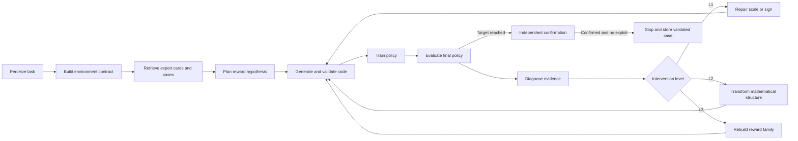

# Architecture

## Design boundary

The system is one logical reward-design agent with a deterministic control kernel. The language model proposes semantic plans and code; deterministic code owns validation, execution, budgets, best-candidate tracking, and stopping.

## Closed loop

## Expert reasoning contract

Every intervention records:

1. A six-dimensional assessment of reachability, directionality, scale, credit assignment, task alignment, and exploit resistance.
2. A functional-role completeness analysis.
3. Diagnosis grounded in named evidence.
4. One falsifiable hypothesis.
5. The component or structure being changed.
6. The mathematical transformation direction.
7. Expected metric changes.

Level 1 handles coefficient, sign, and obvious magnitude defects. Level 2 changes information geometry, for example sparse to dense, state value to state improvement, unbounded to bounded, global constraint to local gate, persistent event to transition event, or proxy to completion signal. Level 3 replaces the structural family after local evidence has failed.

The controlled ontology lives in `knowledge/ontology.py`. The full reasoning explanation lives in `prompts/expert_reasoning_core.md` and is included in both planning and generation calls. RAG cards add task-relevant detail but are not responsible for enforcing the core reasoning process.

## Memory ownership

- Working memory stores resumable current state and best candidate.
- Episodic memory is an append-only within-run causal notebook.
- Semantic memory contains reviewed expert principles and transformations.
- Case memory stores only independently confirmed cross-task outcomes.

The artifact store is not a fifth cognitive memory. It contains code, models, and raw logs referenced by the four memories.

## Behavior adapters

The adapter is selected by priority:

1. A reviewed environment plugin supplies ground-truth task outcomes when available.
2. A generated JSON DSL supplies declared proxies with confidence and provenance.
3. Generic metrics provide returns, lengths, terminations, action statistics, and basic exploit checks.

Generated adapters cannot execute Python. Unsupported facts remain unknown rather than being guessed.

## Production integration boundary

The next backend will wrap the existing training command and parse these stable artifacts:

- `training_summary.json`: training-process statistics.
- `eval_result.json`: fixed final-policy evaluation statistics.
- candidate validation: existing AST validation plus a sandbox smoke call.

Training failures, empty model responses, and invalid code increment engineering attempts. They do not consume scientific reward-search iterations.
